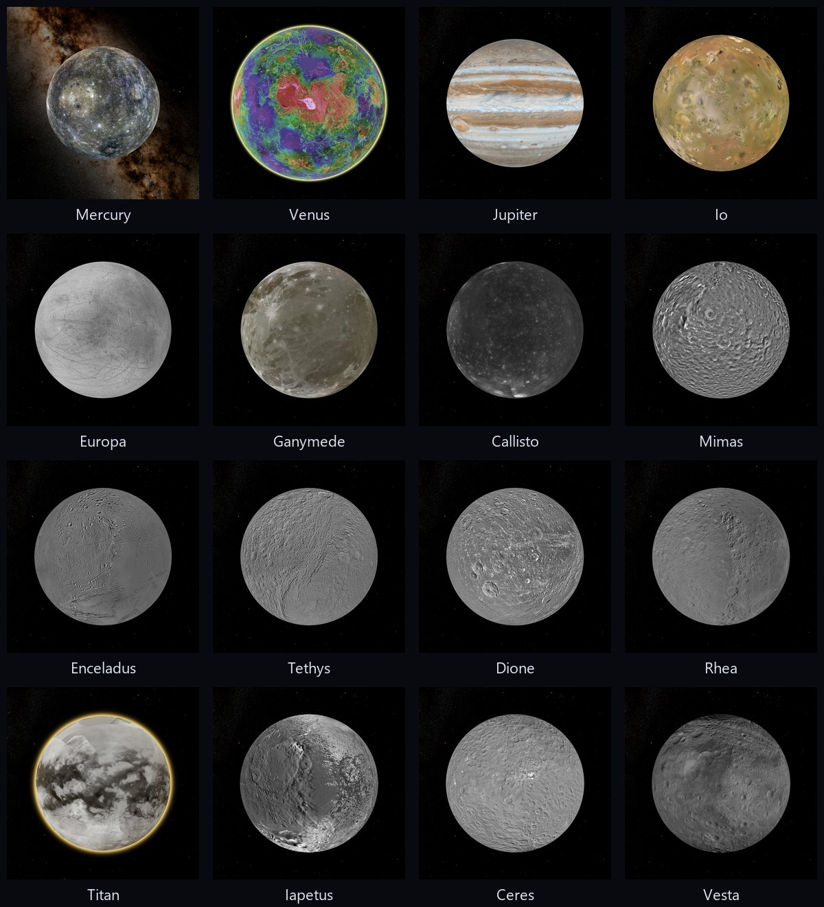

# PlanetX

**English** · [Русский](README.md)

A 3D globe inside QGIS. PlanetX version 0.62.1.

The globe opens in its own window and shows the whole Earth with terrain
and atmosphere, from space down to single streets.

## Features

- **Satellite imagery.** By default the globe shows Esri World Imagery
  as an example base map. The Base map group of the Layers section
  switches it to OpenStreetMap or to XYZ Tiles connections from the
  QGIS browser. A tile source of your own is added by its address in
  any form, the window shows a test mosaic and finds the most detailed
  level itself.
- **Terrain.** Mountains and valleys are three-dimensional, slopes are
  shaded by light from the north-west. Vertical exaggeration is set in
  the view properties. The camera stays at least 50 m above the terrain.
- **Map sheet designation.** The globe menu gives map sheet numbers
  at the point. They are IMW 1:1,000,000, the Russian designation
  down to 1:200,000, the NATO JOG 1:250,000 sheet and the MGRS
  square. Russian State Geological Map sheets use the same numbers.
- **Atmosphere.** A blue glow surrounds the planet. From a low altitude
  the sky is visible at the horizon, and distant mountains fade into haze.
- **Grid, stars, clouds.** A coordinate grid with labels, the equator,
  tropics and polar circles in yellow. The stars
  and the Milky Way stand at their places in the sky. Clouds come from NASA imagery of
  the last complete day. Land and sea temperature from NASA data
  colours the globe, the scale in degrees is in the corner of the view.
- **3D buildings.** OpenStreetMap buildings from OpenFreeMap tiles
  rise as blocks when the camera is closer than 6 km to the ground.
  The height comes from OpenStreetMap or from the number of floors.
- **Sun.** Terrain and buildings are lit by the position of the sun
  at the time slider time or by the clock, the night side of the
  Earth is dark.
- **Other bodies.** The Body icon on the icon bar puts Mercury, Venus,
  the Moon, Mars, Jupiter, its moons Io, Europa, Ganymede and
  Callisto, the moons of Saturn from Mimas to Iapetus, Ceres or Vesta
  in place of the Earth. The imagery comes from
  global NASA and USGS mosaics. Mars terrain is built from MOLA
  heights, Moon terrain from LOLA heights. Navigation, grid, ruler,
  places, tours, view snapshots and scenes work on any body. A place
  remembers its body.
- **Starry sky.** The Body icon also opens the sky from the centre of the
  celestial sphere. It shows the Milky Way, stars, constellation lines
  and names, the Sun, the Moon and the planets at the chosen time.
- **Inside the Earth.** The terrain shows sea and ocean depths under
  semi-transparent water. The Earthquakes layer shows the foci of the last
  30 days from the USGS feed at their depth. The Earth cutaway layer
  removes a sector, its faces show the CRUST1.0 crust, the mantle and
  core of the PREM model and the Slab2 subducting slabs. The corners of
  the sector can be dragged with the mouse. The Section down… item in
  the menu of a path shows a section of the Earth along the path in its
  own window and as a wall on the globe.
- **Subsurface mode.** Drill holes along their survey, bed roofs,
  sections with images and tunnels from project layers go under the
  globe surface with the QGIS style and labels. The surface becomes
  transparent, a polygon of My Places cuts a block, the camera goes
  underground. The Permian deposits and Vegas Loop tunnels demos show
  the mode.
- **Weather.** The Weather group of the map gallery shows air
  temperature, precipitation, wind and clouds of the NOAA GFS model
  at the moment of the time slider. It covers a forecast up to 16
  days and the past.
- **NASA themes.** The Planet of Fire, Planet of Water, Planet of Air and Land
  and Life groups of the map gallery show 23 NASA GIBS rasters by
  date - smoke, carbon monoxide, precipitation, snow, ice, gases,
  vegetation, night lights. The time slider sets the day of a theme.
  The Maps and layers row of the Layers section and an icon
  open the gallery, each map has a preview. A comparison swipe shows
  a theme for two days side by side.
- **Paleogeography.** The Paleogeography layer shows land relief and sea
  depths of the past, up to 540 million years ago, after the PALEOMAP
  PaleoDEM maps. A slider in the corner of the view sets the age.
- **Assistant.** A conversation window with an AI model - Claude, Grok,
  DeepSeek, OpenRouter models or an own model through Ollama. The model
  controls the globe on a request in words - flights, Layers rows,
  sections, point and earthquake information. A request can also be
  typed in the Search field. A button by the Search field makes
  places from a description, for example "the voyage of Columbus", with
  the dates of the events. The model proposes placemarks as a KML
  document, they are written after confirmation. OpenRouter with free
  models is chosen by default, its key is free. Ollama works without a
  key.
- **Left panel.** The sections Places, Project layers and Layers
  collapse with a click on the header.
- **Layers section.** It holds
  the groups Borders and names, Transport and Nature. They hold borders,
  places, water names, roads and road numbers, railways, airports,
  rivers, lakes, peaks, nature reserves and national parks. Check boxes
  take effect at once.
- **Labels.** Labels stay upright at any turn and tilt and do not
  overlap. A place behind a mountain or beyond the horizon is not
  labelled. The label language follows QGIS or is chosen in the view
  properties.
- **Project layers.** Vector and raster layers of the project lie on the
  globe in the QGIS map order. A check mark in the window list shows
  a layer on the globe and leaves the map unchanged. Labels of vector
  layers stay level like city names, with the text and colour of the
  layer labels in QGIS.

## Controls

- **Grab the Earth.** Drag the Earth with the left mouse button. After
  release it keeps rotating by inertia.
- **Zoom to the cursor.** The wheel zooms to the point under the cursor,
  and the point stays in place.
- **Turn and tilt.** The middle button or Shift with the left button turns
  and tilts the view.
- **Mouse and keys.** A left double click flies to the
  point and zooms in, a right double click zooms out. Dragging with the
  right button up zooms in, down zooms out. Ctrl with the left button
  looks around, the eye stays in place. Arrows move the view, with
  Shift they turn and tilt, with Ctrl they look around. PageUp and
  PageDown zoom, N puts north up, U looks straight down, R does both,
  Space stops.
- **On-screen controls.** The top right corner of the view holds
  the compass ring, the look and move sticks and the
  height slider with plus and minus buttons.
- **Search.** Type a place name in the Search field at the top left,
  for example `Perm`, or coordinates in degrees, for example
  `58.0105, 56.2294`. The camera flies there. Over long distances it rises and then lands smoothly. The place
  found is marked with a red pin. If several places are found, the
  others are listed below the field. Clearing the field removes the pin
  and closes the list.
- **Refresh.** The globe refreshes by itself after a change of the
  base map, terrain exaggeration and project layers. If automatic
  refresh is switched off in the view properties, the changes appear
  after the Refresh button in the corner of the view.
- **Map synchronization.** The link button in the corner of the view ties
  the globe to the QGIS map window. The map leads the globe, the globe
  leads the map or both follow each other, as chosen in the view
  properties. Any map coordinate system works.
- **Save view.** The Save view button in the corner of the view puts a
  placemark at the look-at point. A double click on it restores the
  height, heading and tilt of the globe.
- **View snapshot.** The snapshot button in the corner of the view saves
  the view to PNG or JPEG, larger than the window if needed. The globe
  loads detailed tiles for that size, the source credits sit in the
  corner of the snapshot.
- **View to layout.** The layout button puts the view as a fixed picture
  into a QGIS layout, an existing or a new one. The snapshot size follows
  the picture size on the page and the output resolution of the layout.
  The picture is embedded in the project.
- **Layer transparency.** The menu of a project layer in the globe list
  changes the transparency of the QGIS layer with a slider and opens the
  layer properties. The transparency is shared with the map.
- **Selection.** Features selected on the QGIS map are highlighted on the
  globe, features found by a click on the globe are selected on the map.
- **Ruler.** Line, path, polygon and circle by clicks on the globe.
  Length, perimeter and area on the WGS84 ellipsoid, ground length
  and heading, a 3D path and a 3D polygon over roofs and walls of
  buildings. Points are dragged with the mouse. The elevation
  profile of a path shows ascent and slopes. The measurement is
  saved to My Places.
- **Terrain analysis.** The Slope and Aspect rows colour the surface
  of the Earth, Mars and the Moon by slope steepness and by compass
  direction. Viewshed from a point placemark shows the places seen
  from it and those hidden by the terrain. Insolation shows the hours
  of direct sunlight per day for chosen dates, with mountain shadows.
- **Coordinates.** Degrees, degrees-minutes-seconds, UTM or MGRS in
  the status line, search understands all four.
- **My Places.** Placemarks, paths and polygons are drawn by clicks
  on the globe. They, saved views and measurements sit in the My Places
  folder of the Places section. The places file is
  shared by the QGIS profile, so places are visible in any project.
  A double click on a place or folder flies there. A folder has a
  description, a view of its own and can show its contents as option
  buttons, with one place of the folder on the globe.
- **Tour.** Play tour in the menu of My Places or any of its folders
  flies over the checked places in the list order, along a path the
  camera travels the line. Places and folders are rearranged by
  dragging. The bar under the time slider pauses the tour, steps
  between stops and repeats the tour in a loop. It records the tour to
  an MP4 video right away or as PNG frames of any size for editing. The record button records a tour from the
  screen.
- **Placemark time.** A placemark can have a moment or an interval. The
  time slider opens with a button on the icon bar and hides placemarks
  outside the interval.
- **Demo.** The icon with an academic cap opens prepared scenes with
  places and tours. They show Perm, Boca Chica and the Japan Trench with
  a section across the subduction zone on the Earth, landing sites on
  Mars and the Moon, constellations and bright objects in the sky.
- **Scenes.** The whole view - camera, time, layers, settings and a
  places folder with its tour - saves to a file and opens on another
  computer.
- **Tracks.** A point layer with a time field shows as growing paths of
  its objects along the time slider of the globe. The camera can follow
  along the motion. A project layer with QGIS time shows within the
  range of the same slider.
- **Satellites.** The Satellites layer shows stations, navigation,
  weather, geostationary and other satellites from CelesTrak elements
  for the moment of the time slider or by the clock. The selected
  satellite shows its orbit loop and ground track, the camera can
  follow it. The time slider runs at clock speeds up to a day per
  second, the line between day and night and the satellites move
  with it.
- **Route.** Directions from here and Directions to here in the globe
  menu build a path by OpenStreetMap roads by car or on foot. The path
  with the length and travel time goes into My Places. The points lie
  up to 50 km apart.
- **Place properties.** Name, description, icon, colors, time,
  height above ground
  and extending to the ground. A path becomes a wall, a polygon a block.
- **KML and KMZ.** KML and KMZ files, including Google Earth
  ones, open into My Places with folders,
  styles and placemark views. A folder saves to KMZ or KML.
- **Image overlays.** A ground overlay by a box or four corners, a photo
  with a camera and a screen overlay, as in Google Earth. The image is
  kept in the places file or as a link to a file or address. A
  ground overlay goes into the QGIS project as a GeoTIFF layer.
- **Own terrain.** A height raster of the project, for example a
  quarry survey, becomes the globe terrain within its extent, more
  detailed than the common terrain, down to the raster pixel.
- **Pythagoras project.** A .pyt file goes to the QGIS project as
  GeoPackage layers by Pythagoras layers - points, lines, areas and
  texts with numbers, codes and elevations.
- **Copy and paste.** Places and folders are copied to the clipboard
  as KML text and pasted back, also after editing in a text editor and
  from Google Earth.
- **Identify features.** In the Identify features mode a click on the
  globe shows the coordinates and elevation of the point and the features
  of the project layers checked on the globe.

The View properties icon on the icon bar opens the view properties.
Tiles come
through the QGIS network settings and cache. The About button in the
globe window lists the controls and the data sources.

Everything is described in detail in the manual - [doc/MANUAL.en.md](doc/MANUAL.en.md).
A PDF manual with pictures ships with the plugin and opens from the
About window.

## Installation

In QGIS open **Plugins → Manage and Install Plugins**, find PlanetX
and install it. The globe opens with the button on the PlanetX toolbar
or from **Web → PlanetX**.

## Requirements

- QGIS 3.36 or newer, QGIS 4 included. Tested on QGIS 3.36 with Qt 5
  and on QGIS 4.0 with Qt 6.
- A graphics card with OpenGL 3.3.
- The PyOpenGL Python module. QGIS builds for Windows include it.

## Sources

Satellite imagery is Esri World Imagery, credited to Esri, Vantor,
Earthstar Geographics, and the GIS User Community. Esri sets the terms
of use.

Map data © OpenStreetMap contributors,
[terms of use](https://www.openstreetmap.org/copyright). Vector tiles
and 3D buildings come from [OpenFreeMap](https://openfreemap.org/).

Terrain comes from [Mapzen Terrain Tiles](https://github.com/tilezen/joerd/blob/master/docs/attribution.md),
data from SRTM, GMTED, ETOPO1 and other sources.

Clouds come from [NASA GIBS](https://www.earthdata.nasa.gov/engage/open-data-services-software/earthdata-developer-portal/gibs-api),
VIIRS imagery. Temperature comes from NASA GIBS, MODIS and GHRSST MUR.
Stars come from the Yale Bright Star Catalogue. The
Milky Way comes from [NASA/Goddard Space Flight Center Scientific Visualization Studio](https://svs.gsfc.nasa.gov/4851),
Gaia DR2: ESA/Gaia/DPAC.

Mars imagery: NASA, USGS, Viking MDIM2.1. Moon imagery: USGS,
LRO LOLA. Tiles of both bodies come from [OpenPlanetaryMap](https://github.com/openplanetary/opm/wiki/OPM-Basemaps).
Mars heights come from NASA MGS MOLA MEGDR, Moon heights from NASA
LRO LOLA GDR. Imagery of other bodies comes from global mosaics of
[USGS Astrogeology](https://astrogeology.usgs.gov/search) and NASA
Photojournal, made from MESSENGER, Magellan, Galileo, Voyager,
Cassini and Dawn data.
Constellations and star names come from [d3-celestial](https://github.com/ofrohn/d3-celestial),
© Olaf Frohn. Planet positions are computed from JPL orbital
elements.

Data sources and their terms of use are described in [doc/SOURCES.md](doc/SOURCES.md), in Russian.

Developed with the support of Inform++ LLC (https://www.informpp.ru/).
License GNU GPL version 3.
