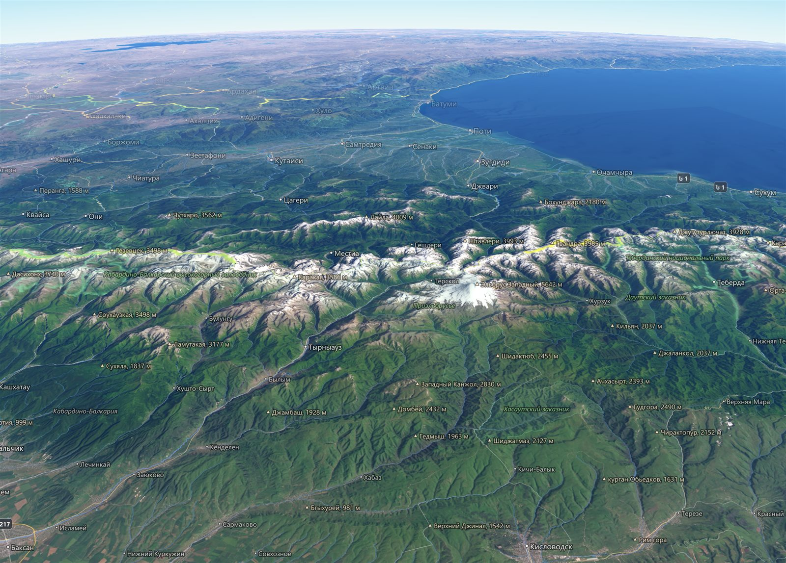
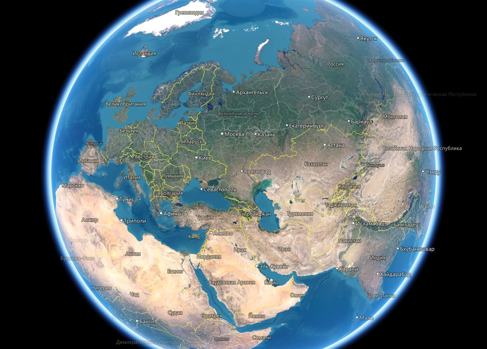
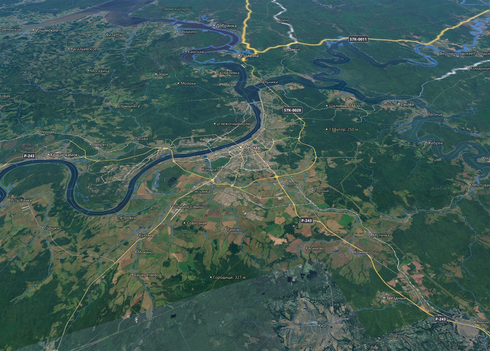

# PlanetX

[English](README.en.md) · **Русский**

Трёхмерный глобус внутри QGIS в духе Google Earth. Версия PlanetX 0.5.2.

Глобус открывается в отдельном окне и показывает всю Землю с рельефом
и атмосферой, от вида из космоса до отдельных улиц.

## Возможности

- **Космоснимки.** По умолчанию глобус показывает Esri World Imagery как
  пример подложки. В свойствах вида подложка меняется на OpenStreetMap
  или на подключения XYZ Tiles из обозревателя QGIS.
- **Рельеф.** Горы и долины объёмные, склоны оттенены светом
  с северо-запада. Вертикальный масштаб рельефа задаётся в свойствах
  вида. Камера не опускается ниже 50 м над рельефом.
- **Атмосфера.** Вокруг планеты светится голубое гало. С малой высоты
  у горизонта видно небо, дальние горы уходят в дымку.
- **Панель «Слои».** Внизу слева, как в Google Earth, лежат группы
  «Границы и названия», «Транспорт» и «Природа». В них границы,
  населённые пункты, названия водоёмов, дороги и их номера, железные
  дороги, аэропорты, реки, водоёмы, вершины, заповедники
  и национальные парки. Флажки срабатывают сразу.
- **Подписи.** Надписи стоят прямо при любом повороте и наклоне и не
  налезают друг на друга. Пункт за горой или за горизонтом не подписан.
  Язык подписей совпадает с языком QGIS или выбирается в свойствах вида.
- **Слои проекта.** Векторные и растровые слои проекта ложатся
  на глобус в порядке карты QGIS. Отметка слоя в списке окна показывает
  его на глобусе и не меняет карту.

## Управление

- **Захват Земли.** Земля тянется левой кнопкой мыши и после отпускания
  продолжает вращаться по инерции.
- **Приближение к курсору.** Колесо приближает к точке под курсором,
  точка остаётся на месте.
- **Поворот и наклон.** Средняя кнопка или левая с Shift поворачивают
  и наклоняют вид.
- **Поиск.** В поле «Поиск» вверху слева вводится название места,
  например `Пермь`, или координаты в градусах, например
  `58.0105, 56.2294`. Камера перелетает туда по пути van Wijk и Nuij.
  На дальнее расстояние она поднимается и плавно садится. Найденное
  место отмечено красной меткой. Если мест несколько, остальные
  показываются списком под полем. Очистка поля снимает метку
  и закрывает список.
- **Обновление.** Смена подложки, масштаба рельефа и слоёв проекта
  видна после кнопки «Обновить» в углу вида. В свойствах вида
  включается автоматическое обновление.
- **Синхронизация с картой.** Значок связи в углу вида связывает глобус
  с окном карты QGIS. Карта ведёт глобус, глобус ведёт карту или оба
  следуют друг за другом - это выбирается в свойствах вида. Система
  координат карты любая.
- **Сохранить вид.** Значок «Сохранить вид» в углу вида ставит метку
  в точке взгляда. Двойной щелчок по ней возвращает высоту, азимут
  и наклон глобуса.
- **Снимок вида.** Значок снимка в углу вида сохраняет вид в PNG или
  JPEG, в том числе больше окна. Глобус догружает подробные тайлы
  для этого размера, подпись источников стоит в углу снимка.
- **Вид в макет.** Значок макета кладёт вид неизменной картинкой
  в макет QGIS, существующий или новый. Размер снимка берётся
  по размеру картинки на листе и разрешению вывода макета. Картинка
  хранится внутри проекта.
- **Прозрачность слоёв.** Меню слоя проекта в списке глобуса
  меняет прозрачность слоя QGIS ползунком и открывает свойства слоя.
  Прозрачность общая с картой.
- **Выделение.** Выделенное на карте QGIS подсвечено на глобусе,
  найденное щелчком по глобусу выделяется на карте.
- **Линейка.** Линия, путь, многоугольник и круг щелчками по глобусу.
  Длина, периметр и площадь на эллипсоиде WGS84. Измерение
  сохраняется в «Мои метки».
- **Мои метки.** Метки, пути и многоугольники рисуются щелчками прямо
  на глобусе. Они, сохранённые виды и измерения лежат в папке «Мои
  метки» под строкой «Глобус», как в Google Earth. Файл меток общий
  для профиля QGIS, метки видны в любом проекте. Двойной щелчок
  по метке переносит к ней.
- **Тур.** «Запустить тур» в меню «Моих меток» или любой их папки
  облетает отмеченные метки по порядку списка, вдоль пути камера
  едет по линии. Метки и папки переставляются перетаскиванием.
  Панель внизу вида ставит тур на паузу и переходит между
  остановками.
- **Треки.** Точечный слой с полем времени показывается растущими
  путями объектов по «Временному контроллеру» QGIS. Камера может идти
  следом по ходу движения.
- **Свойства меток.** Название, описание, цвета, высота над землёй
  и выдавливание. Путь становится стеной, многоугольник - объёмом.
- **KML и KMZ.** Файлы Google Earth открываются в «Мои метки» с папками,
  стилями и видами меток. Папка сохраняется в KMZ или KML.
- **Определение объектов.** В режиме «Определить объекты» щелчок
  по глобусу показывает координаты и высоту точки и объекты слоёв
  проекта, отмеченных на глобусе.

Двойной щелчок по строке «Глобус» открывает свойства вида. Тайлы идут
через сетевые настройки и кэш QGIS. Кнопка «О модуле» в окне глобуса
напоминает управление и источники данных.

## Установка

В QGIS откройте **Модули → Управление модулями**, найдите PlanetX
и установите. Глобус открывается значком на панели инструментов
PlanetX или из меню **Интернет → PlanetX**.

## Требования

- QGIS 3.36 и новее, в том числе QGIS 4. Проверено на QGIS 3.36 с Qt 5
  и на QGIS 4.0 с Qt 6.
- Видеокарта с OpenGL 3.3.
- Модуль Python PyOpenGL. В сборках QGIS для Windows он есть.

## Источники

Космоснимки - Esri World Imagery. Подпись источника - Esri, Vantor,
Earthstar Geographics, and the GIS User Community. Условия
использования задаёт Esri.

Картографические данные © участники OpenStreetMap,
[условия использования](https://www.openstreetmap.org/copyright).
Векторные тайлы - [OpenFreeMap](https://openfreemap.org/).

Рельеф - [Mapzen Terrain Tiles](https://github.com/tilezen/joerd/blob/master/docs/attribution.md),
данные SRTM, GMTED, ETOPO1 и других источников.

Подробно об источниках данных и условиях их использования -
[doc/SOURCES.md](doc/SOURCES.md).

Разработка при поддержке ООО «Информ++» (https://www.informpp.ru/).
Лицензия GNU GPL версии 3.
