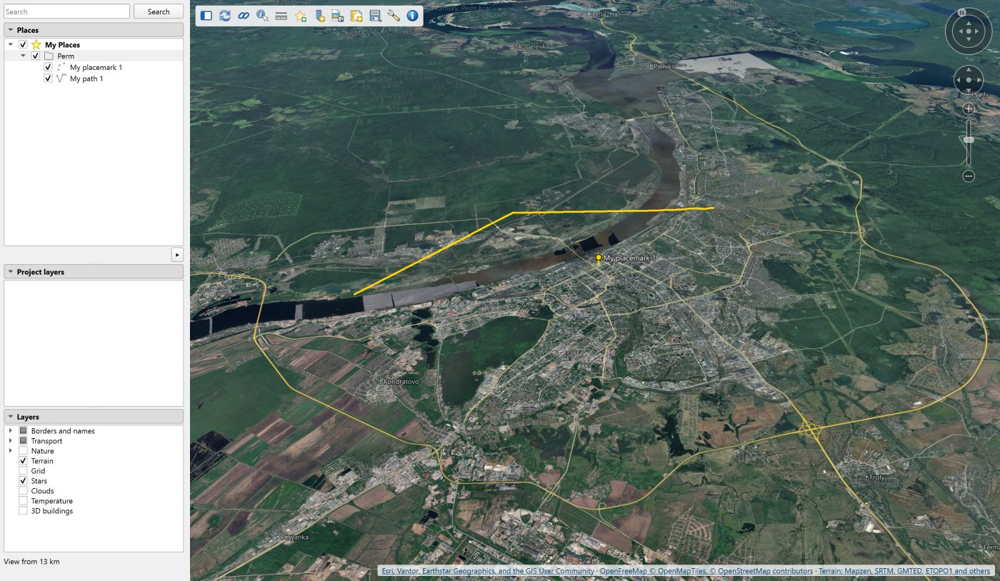
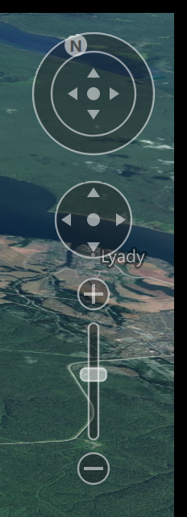
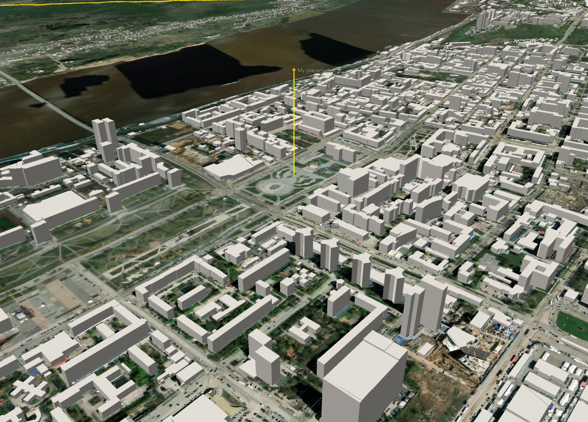
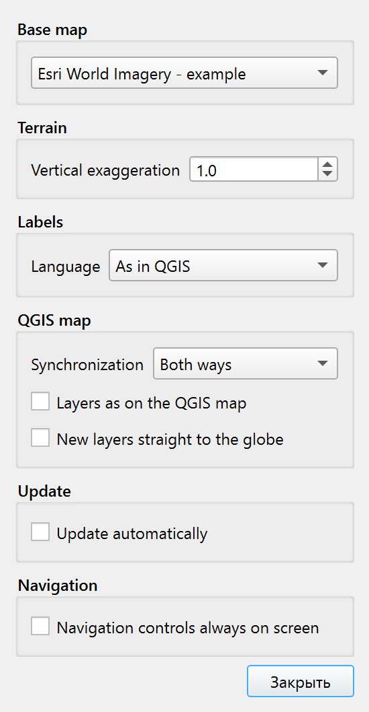
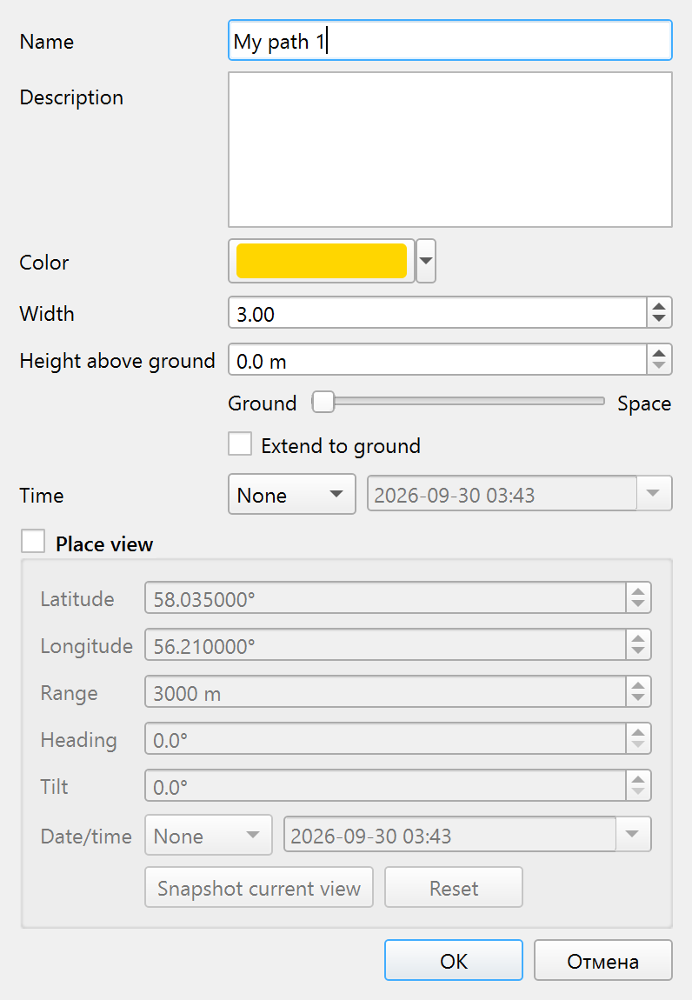
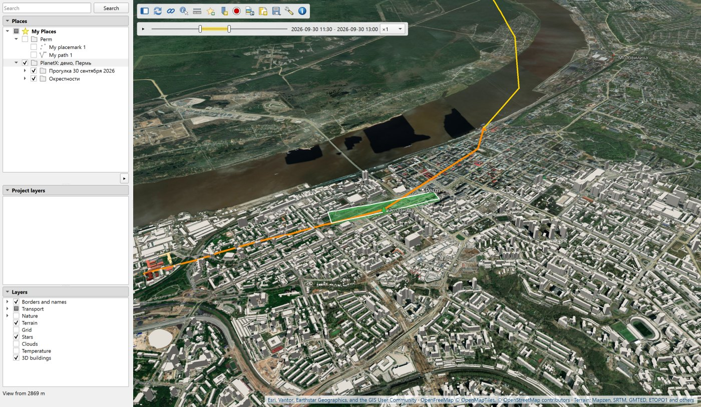
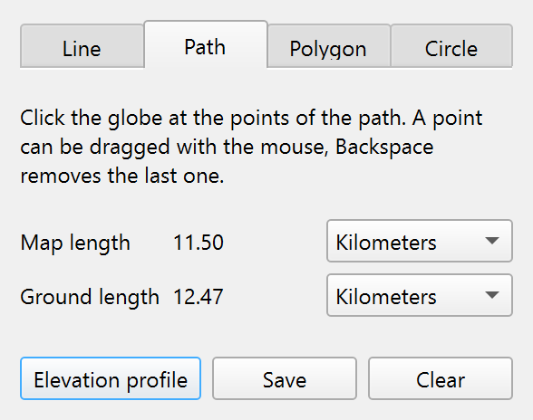
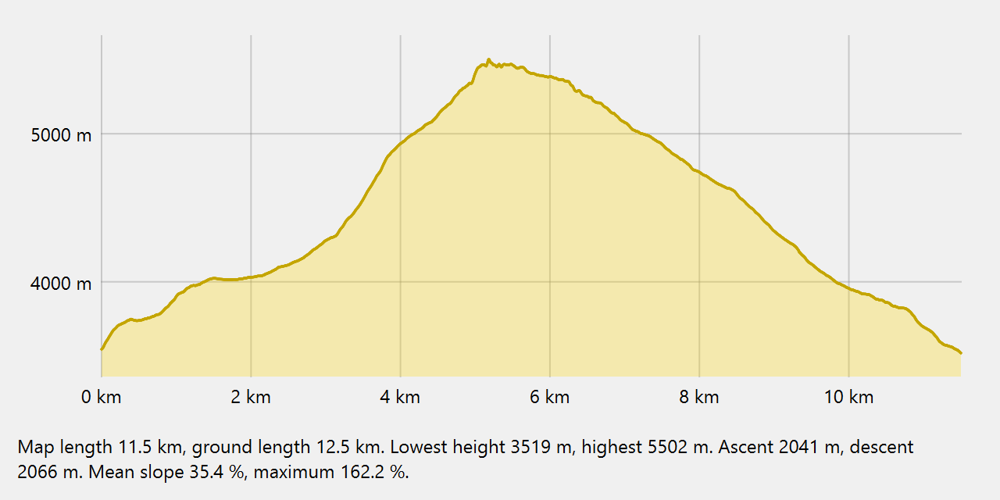

# PlanetX. Manual

[Русская версия](MANUAL.md)

Version 0.18.0

PlanetX is a 3D globe inside QGIS. The
globe opens in its own window and shows the whole Earth with terrain
and atmosphere, from space down to single streets. Layers of the current
project, your own placemarks, paths and polygons lie on the globe. Tours
fly over the places, and a tour recording gives frames for a video.

Plugin page - [www.informpp.ru](https://www.informpp.ru/главная-страница/qgis-planetx).

---

## Installation

The plugin runs in QGIS 3.36 and newer, including QGIS 4. It is tested on
QGIS 3.36 with Qt 5 and on QGIS 4.0 with Qt 6. It needs a graphics card
with OpenGL 3.3 and the Python module PyOpenGL. QGIS builds for Windows
include PyOpenGL.

Open **Plugins → Manage and Install Plugins**, search for PlanetX and
install it. QGIS does not need a restart.

The globe opens with the button on the PlanetX toolbar or from
**Web → PlanetX**. The same menu holds About PlanetX. If the QGIS build
has no PyOpenGL, the plugin says so and does not open the window.

## Interface language

The language follows the QGIS settings, not the system. With Russian in
QGIS the plugin is in Russian, with any other language it is in English.
The label language on the globe is set separately, in the view
properties.

---

## The globe window

The panel is on the left, the globe view on the right. The icon bar
sits in the top left corner of the view, the data source credits in the
bottom right corner. The border between the panel and the view is
dragged with the mouse.



### Icon bar

| Icon | What it does |
|---|---|
| Sidebar | Hides and shows the left panel, the view takes its place |
| Refresh | Shows new settings and layers. The icon is visible only when automatic update is off in the View properties window. It turns orange when there is something to show |
| Synchronization | Links the globe with the QGIS map window |
| Identify features | Turns on identify by a click on the globe |
| Ruler | Opens the Ruler window |
| New placemark | Opens the New placemark window |
| Save view | Puts a placemark at the look-at point with height, heading and tilt |
| Record a flight | Records the camera movement as a tour into My Places. The ⏺ button of the tour bar records a tour to video |
| Time slider | Opens and closes the time slider. The slider is shared by placemarks, tracks, project layers, events, maps and the globe clock. It is available when visible data has a time |
| View snapshot | Saves the view to a PNG or JPEG file |
| View to layout | Puts the view into a QGIS layout as a picture |
| Scene | The menu Save Scene… and Open Scene… |
| Demo | Ready scenes by body, see [Demo](#demo) |
| Body | The menu of planets, moons, asteroids and Sky, see [Other bodies](#other-bodies) and [Starry sky](#starry-sky) |
| View properties | Base map and data sources, terrain, labels, link with the map, update, coordinate format, subsurface mode, assistant |
| About | Controls, data sources, links |

### Status line

The status line sits under the left panel. It usually shows the camera
height, for example "Overview from 2 000 km". The second line shows the
coordinates and elevation of the point under the cursor. The coordinate
format is chosen in the view properties.

The line also reports loading:

- "loading 12" - this many tiles, layer pictures and labels still wait
  for loading.
- "loading has stalled for 7 s" - data waits and nothing has arrived for
  5 seconds or longer.
- "places are heavy, 250 thousand vertices" - your own objects exceed
  200 thousand vertices, turning may become slow.
- "The base map did not load" and "The vector base did not load" - the
  source answered with an error.

While loading goes on, a blue icon spins to the right of the icon bar.
A short load does not light it, it appears after half a second. When
loading stalls, the icon turns orange. Its tooltip tells how much still
waits.

Messages of search, scenes, tours and recording stay for 5 seconds.

---

## Navigation

Navigation uses the mouse, the keys and the navigation controls.

### Mouse

| Action | What happens |
|---|---|
| Left button drag | The Earth follows the cursor. After release it spins on by inertia |
| Wheel | Zooms in and out. The point under the cursor stays in place |
| Left double click | Flies to the point under the cursor and zooms in 2.5 times |
| Right double click | Zooms out 2.5 times |
| Right button drag | Up - closer, down - farther, toward the press point |
| Right click | The menu of the point under the cursor |
| Middle button or left with Shift | Turn and tilt around the look-at point |
| Left button with Ctrl | Looks around, the eye stays in place |

The camera does not go lower than 50 m above the terrain. The tilt is
limited to 85°. While the ruler, drawing or identify is on, a double
click stays two plain clicks and places points.

### Keys

Keys work when the globe view has focus. A click on the globe gives it
focus.

| Key | What happens |
|---|---|
| Arrows | Move the view by a twentieth of the window width |
| Shift and arrows | Turn and tilt by 3° |
| Ctrl and arrows | Look around by 3° |
| PageUp, plus | Zoom in by a wheel step |
| PageDown, minus | Zoom out by a wheel step |
| N | North up |
| U | Look straight down |
| R | North up and look straight down |
| Space | Stop inertia and flight |

### On-screen controls

The navigation controls stand in the top right corner of the view.



| Control | What it does |
|---|---|
| Compass ring | Dragging turns the view. The letter N shows north |
| Letter N | A click puts north up |
| Stick inside the ring | While the button is held, the view looks toward the press |
| Lower stick | While the button is held, the view moves toward the press |
| Plus and minus | While the button is held, the camera zooms in or out smoothly |
| Slider | The thumb stands at the camera height, dragging sets a new one |

The speed of the sticks grows with the distance from the middle. The
controls are always shown. While the cursor is far away, they stand
as a faint outline and do not cover the view. When the cursor comes
near the corner of the view, they are drawn in full.

### Place search

Type a place name into the Search field at the top of the panel, for
example `Perm`, coordinates or a topic, for example "Voyages of
Columbus" - this example stands grey in the empty field. Enter or the
Search button starts the search. A topic without a place on the map
becomes placemarks, see Places from a description.

| Format | Example |
|---|---|
| Decimal degrees | `58.0105, 56.2294` |
| Degrees, minutes, seconds | `58°00′37.8″ N, 56°13′45.8″ E` or `58 00 37.8 N 56 13 45.8 E` |
| UTM | `40V 454464 6430139` |
| MGRS | `40V DK 54464 30138` |

Search also understands the coordinates copied from the status line
of the globe together with the elevation.

- Coordinates start a flight at once. The camera lands no higher than
  2 km from the point.
- A name goes to the Nominatim service in the label language. The camera
  flies to the first place found and frames it whole.
- When several places are found, they are listed under the field. A
  click on a row starts a flight.
- The found place carries a red pin. Clearing the field removes the pin
  and closes the list.

Suggestions of three kinds appear below the field while typing:

- Placemarks of My Places on the body on the screen with a matching
  name.
- Earlier queries.
- Stars and constellations when the sky view is open.

A click on a suggestion or Enter on it starts a flight to the placemark
or the sky object, an earlier query is searched again. The Down key
moves into the list of suggestions, in an empty field it shows the
earlier queries. Escape closes the list. Place names from the network
are not suggested while typing. The Nominatim service takes a query
only on Enter.

Enter in the field handles the query in this order:

1. Coordinates start a flight.
2. The exact name of an own placemark starts a flight to it with no
   network request. In the sky view the name of a star or
   a constellation works the same way.
3. A request in words goes to the assistant, the Assistant section
   describes it.
4. Anything else is searched as a place name.

Queries entered with Enter are kept in the QGIS profile, 30 at most.
The Clear search history button of the Assistant group in the View
properties window erases them.

Over a long distance the camera rises and lands smoothly. The mouse interrupts a flight.

---

## Left panel

The panel has three sections - Places, Project layers and Layers. A
click on a header collapses the section, and the open sections take its
place. The globe remembers which sections are collapsed.

### Layers section

Its check boxes
take effect at once, without the Refresh button.

| Part | Rows |
|---|---|
| Base map | Sources of imagery and maps, an option button selects one, the last row is Add tile source… |
| Terrain | Mapzen Terrain Tiles elevations and hill shading |
| Maps and layers | The row opens the gallery of maps and layers, see Maps and layers |
| Map | Borders and names, Transport, Nature - the vector base, Coordinate grid, 3D buildings |

The part headings have no check boxes, the rows have them. The vector
base has three groups. Borders and names holds Borders, Places and
Water names. Transport holds Roads, Road numbers, Railways and
Airports. Nature holds Rivers, Lakes and reservoirs, Peaks, Reserves
and national parks.

The vector base comes from OpenFreeMap tiles. On the first opening
borders, places, terrain and stars are on. The tooltip of each row
tells how the feature is drawn and from what height it is visible.

The grid step follows the camera height, from 30° from space to
seconds near the ground. The stars stand where they stand over the
Earth at this minute and fade when the camera goes below 150 km. The
Milky Way image, about 10 MB, is downloaded when the stars are first
shown and comes from the QGIS cache afterwards.
Clouds lie as a veil over the imagery. Snow and ice get into the
clouds too, they have the same colour.

The Surface temperature map of the gallery colours land and sea with
their own scales. The scales in degrees Celsius are in the bottom left
corner of the view. Land shows
the temperature of the surface itself by day, not of the air, over 8
days. Land may have gaps under clouds. Sea shows the water temperature
near the surface over a day.

The Sun layer lights the terrain and buildings from the side of the
sun. The night side of the Earth is dark, the air over it does not
glow. City lights shine on it - the NASA Black Marble image of 2016,
pixel about 600 m. In the twilight the lights fade together with the
night, under clouds they are weaker. The sun time is the end of the interval of the open time
slider, so the light of the hour of a placemark shows. Without the
slider the sun follows the computer clock. Without the Sun layer the
light falls from the north-west at 45°, as on a relief map. The
position of the sun is computed to about 0.01°, there are no
shadows.

Labels stay level at any turn and tilt and do not overlap. A place
behind a mountain or beyond the horizon has no label.

The Slope and Aspect layers colour the surface by the terrain heights.
Slope is the angle of the surface to the horizontal, in classes 0-2°,
2-5°, 5-10°, 10-15°, 15-25°, 25-35° and steeper than 35°, from green
to purple. Aspect is the compass direction a slope faces downhill,
each of the eight directions has its colour, ground flatter than 0.5°
is grey. The scale is in the bottom left corner of the view. The slope
is computed from the true heights, without the vertical exaggeration
of the view. The layer exists on the Earth, Mars and the Moon, other
bodies have no heights. The accuracy is limited by the height pixel.
It is about 5 m at the equator on the most detailed level on the Earth,
2.6 km on Mars, 1.3 km on the Moon.

The Contours layer draws lines of equal height on the surface, as on
a topographic map. The contour interval depends on the zoom. It is
1, 2, 2.5 or 5 metres times a power of ten. Close up at middle
latitudes it is 5 m, from tens of kilometres up it is 20-50 m. Every
fifth contour is thicker. Below sea level the lines are blue, these
are depth contours. Where contours merge on a steep slope, they fade.
Contours are built from the same heights as the slope and have the
same accuracy. The layer exists on the Earth, Mars and the Moon.

Sea and ocean depths are part of the terrain. The floor lies at its
depths, and semi-transparent water lies above it at sea level. Water
shallower than 200 m is more transparent, the floor shows near the
shore. Below sea level the status bar shows the depth under the
cursor. The depths come from the same Terrarium tiles as the land
heights, in the ocean these are ETOPO1 data. Sea names stay at sea
level. The elevation profile, the ruler and the slope use the floor,
the viewshed and insolation use the water surface. A profile below
sea level shows the water and a dashed sea level line. Dry
depressions below zero, for example the Dead Sea, are not told apart
from the sea by the heights and are filled on the profile too. The
Sea and ocean depths box in the Terrain group of the view properties
switches them off, then heights below sea level count as zero and the
sea is flat. Depths exist only on the Earth.

The Paleogeography layer shows the Earth in the past, up to 540 million
years ago, after the PALEOMAP PaleoDEM maps (Scotese and Wright, 2018).
The map of an age holds land heights and sea depths on a 0.1° grid,
about 11 km, coloured by height with hill shading. A slider in the
bottom left corner of the view sets the age in millions of years in
steps of 5 million years, the geological period is named next to it.
The ▶ button shows the ages one after another towards the present.
Today's imagery, borders, labels and relief are removed for that time,
the relief setting itself does not change. The maps lie as tiles in
the planetx-terrain repository, the first showing of an age needs the
internet. A new age appears at once in a coarse form and sharpens as
it loads. When the window opens, the row is off.

#### Maps and layers

The Maps and layers row of the Layers section opens the gallery. It holds NASA and weather maps and three groups of layers.
Sky and light holds Stars, Clouds, Sun and Satellites. Inside the
Earth holds Earthquakes, Plate boundaries, Earth cutaway and
Paleogeography. Terrain analysis holds Slope, Aspect and Contours. A click switches a layer on or off
independently of other layers and of the map, a layer that is on has
a green badge. The Satellites tab of the gallery shows cards of the
satellite groups. A click on a card shows or removes a group. The
first group switches the Satellites layer on, the last removed one
switches it off.

Each map has a preview - its tile
over Eurasia on the latest ready day over the base map. Forecast fields
and fires show a strip of the scale colours instead of a tile. The name
and the day of the map stand under the preview. The buttons at the top
keep the maps of one group, the Find a map field searches by name. A
click on a map shows it on the globe, a second click removes it. The
cross on its scale in the lower left corner of the view also removes
the map. The globe shows one map of the gallery, its name stands in
the Maps and layers row.

NASA themes are rasters by days, months or years from the NASA GIBS
service. A day of a series counts as ready a day later, before that
its image is empty. The groups of the gallery hold:
- Planet of Fire - fire spots, smoke, aerosol optical depth, carbon
  monoxide and its emission.
- Planet of Water - precipitation, soil moisture, daily snow, snow over
  8 days, snow mass, sea ice, water vapour, chlorophyll, sea salinity
  and floods.
- Planet of Air - nitrogen dioxide, sulphur dioxide, methane, carbon
  dioxide and ozone.
- Land and Life - vegetation, dust, night lights and land cover.

The theme lies as semi-transparent colouring over the
imagery, where there is no data the imagery shows. A legend with the
name, units and date stands in the bottom left corner of the view. The
day of the theme is set by the right handle of the time slider, see
Placemark time and the time slider. A chosen theme opens the slider on
the last day of its series. The handle gives the nearest day of the
series that is not later, missing days of the series are skipped. A new
theme takes the same moment while the slider is open. Some series lag
behind today by months, the tooltip of the theme says so. Themes exist only on the Earth.

Daily snow from MODIS imagery shows only where the day had no clouds
and was light. On 15 January 2026 over West Siberia clouds and the
polar night hid snow on 78 % of the area. The 8-day summary is hidden
on 40 %. Snow mass is a SMAP model calculation from satellite data,
it has no gaps under clouds. The snow themes show land only. Lake ice
is in the 8-day summary, sea ice is the Sea ice theme.

#### Comparison swipe

The ⇆ button of the time slider splits the view with a swipe. Right
of the swipe the theme is shown for the day of the slider, left of it
for a day of its own. By default this is the same day a year ago, for
a series shorter than a year its first day. Tags with the days of both
sides stand above the swipe. The ‹ and › buttons of the left tag move
its day along the theme series, the cross removes the swipe. The swipe
is dragged with the mouse by the strip with a circle.

The white line along the border is also on a view snapshot and in
a tour recording. The swipe works with NASA themes. GFS forecast
fields, fires and surface temperature have no swipe. A change of
theme keeps the swipe, its day is looked up in the series of the new
theme. Switching the theme off removes the swipe.

#### Weather

The Weather group stands first in the gallery. Its first map is
Surface temperature of land and sea from NASA. The others are Air
temperature at 2 m, Precipitation in mm/h, Wind at 10 m in m/s
and Clouds in percent. The fields come from the NOAA GFS forecast
model with a 0.25° grid, about 28 km. A field is chosen in the
gallery, as a NASA theme.

The time slider sets the moment of the field. A chosen field opens
the slider at the present moment. The slider spans 10 days before
the latest model run and 16 days of forecast after it. The future is
the forecast of the latest run, hourly for the first 5 days, then
every 3 hours. The past is the model analysis for the nearest hour.
The ‹ and › buttons of the slider move the moment by an hour, ▶ shows
the hours one after another and waits for each to load. The model
runs 4 times a day, a new run is published 4-5 hours later.

A field for the whole world weighs 0.5-0.8 MB and arrives in a few
seconds. The legend in the bottom left corner shows the units and the
valid time of the field in UTC. It is a model calculation. Model
clouds are not a cloud image, the Clouds layer gives the image.

The values of the field stand over its colours. Temperature is in
degrees, precipitation in mm/h, wind in m/s, clouds in percent. The
values stand at the nodes of a latitude and longitude grid, about six
across the view. The node step changes with the eye height, from 30°
from space to 0.25° close up. The values come from the same field,
there are no new network requests. Where precipitation is below
0.1 mm/h, there are no precipitation values.

The first map of the Planet of Fire is Fires. It shows
fire spots over the last 24 hours from VIIRS
images of the NOAA-20 satellite from the NASA FIRMS feed, about 78
thousand spots. A dot stands at the fire, its colour and size show the
radiative power from 1 to 1000 MW, the legend stands in the bottom left
corner of the view. The feed, about 6 MB, is loaded each time the row is
switched on. The spots stand on the time slider by the image time. A
click on a spot in the Identify mode shows its power, image time and
confidence.

The Plate boundaries layer shows the lithospheric plate boundaries after
the PB2002 model (Bird, 2003). Red lines are plates moving apart at
oceanic ridges and continental rifts, green - plates sliding along
transform faults, blue - plates converging in subduction and collision
zones. Plate names show as labels. A click near a boundary in the
Identify mode shows the boundary type, the plate pair and the speed of
their relative motion in mm/yr. In the plate pair a slash in Bird's
notation shows which plate goes under which: "PA\OK" is the Pacific
plate under the Okhotsk plate.

The Earthquakes layer shows earthquakes of magnitude 4.5 and above
over the last 30 days from the feed of the U.S. Geological Survey
(USGS). The feed is loaded each time the row is switched on. A circle
marks the focus at its depth, and a thin line leads from it to the
epicentre on the surface. The colour of the circle shows the focus
depth, from red near the surface to purple at 700 km, the scale is in
the bottom left corner of the view. The circle grows with the
magnitude. Foci show through the surface, foci on the far side of the
Earth are hidden. The depth is stretched by the vertical exaggeration
of the terrain, like the heights. Each event has a time. With the row
on, the time slider becomes available, and it shows the events of the
chosen interval. The row exists only on the Earth.

The Earth cutaway layer removes a sector of the Earth under the look-at
point. The sector is a quarter of a hemisphere 90° wide in longitude,
from the equator to the pole of the hemisphere of the look-at point.
Its three faces are coloured by shells after the radii of the PREM
model. These are the crust to 24.4 km, the upper mantle to 400 km,
the transition zone to 670 km, the lower mantle to 2891 km, the outer
core to 5149.5 km and the inner core. The shell scale is in the bottom
left corner of the view. The edge of the faces lies on the ellipsoid,
the depths are not stretched by the vertical exaggeration. The crust
on the faces comes from the CRUST1.0 model in 1° cells. These are
water, ice, upper, middle and lower sediments, upper, middle and lower
crust, below the Moho the mantle begins. The crust is 6-7 km thick
under the ocean and about 70 km under Tibet. Where a face crosses a subduction zone, the subducting
slab from the Slab2 model of the U.S. Geological Survey shows on it as
a band from the upper surface of the slab down by its thickness. Slabs
exist in 27 zones. The file of a zone is requested when a face touches
it, the loading icon shows this. The model is downloaded
from the site of its authors when the row is first switched on, until
then the crust is the 24.4 km PREM layer. The crust layers can be told
apart up close, where the depths on the faces are true. As the camera
moves away, depths to 400 km are stretched so that the crust stays
visible. At the surface the stretch reaches 8 times, towards 400 km
it fades out, below the scale is true. The shell scale shows the
factor, earthquake foci are stretched the same way.
Labels of
places in the removed sector are not shown. The sector is placed anew
each time the row is switched on. The corners of the sector are
marked with points showing their latitude and longitude, and they can
be dragged with the mouse. A corner changes its own longitude and its
own latitude. If the latitude is neither 0° nor a pole, the lower or
upper face becomes a cone towards the centre of the Earth. The row
exists only on the Earth.

The Section down… item in the menu of a path in My Places opens the
Section window. It shows a section of the Earth down along the path.
The distance from the start of the path runs across, the depth runs
down.
The section shows the CRUST1.0 crust layers, the PREM shells, the
Slab2 slabs and earthquake foci from a band along the path. The
colours are those of the Earth cutaway faces, the layer scale is to
the right of the chart. The Depth list sets the depth of the section,
from 100 km to the centre of the Earth. The Foci band field sets the
width of the band. A focus is moved onto the section at the nearest
point of the path. The cursor over the chart marks the point on the
globe and shows the Moho and slab depths there. The crust, the slabs
and the earthquake feed are loaded when the window opens, if they are
not there yet, the line under the chart tells what is still loading.
While the window is open, a wall of the same section hangs along the
path on the globe. It shows through the surface, its depths are true.
When the window closes, the wall disappears.

### Base map and a tile source of your own

The Base map group lists Esri World Imagery, OpenStreetMap and the XYZ
Tiles connections of the QGIS browser. Checking a row changes the base
map on the globe at once. On other bodies the group shows the imagery
of the body, the choice is not available.

The row Add tile source… opens the new source window. The Address
field takes an address in any of these forms:

- a template with `{z}`, `{x}`, `{y}`, for example
  `https://{s}.tile.opentopomap.org/{z}/{x}/{y}.png`
- the address of one tile copied from a browser, for example
  `https://server.arcgisonline.com/ArcGIS/rest/services/World_Topo_Map/MapServer/tile/5/10/17`
- an address with the level, column and row in the query

The window turns the address into a template and suggests a name from
the server name. Below it builds a mosaic of the whole world from four
level 1 tiles. If north is at the bottom of the mosaic, the server
rows go from the bottom up, the box Rows from the bottom up (TMS)
fixes this. The window finds the most detailed level itself by asking
for tiles at the look point of the globe. No-data placeholders do not
count. The source credit is in the corner of the view and on
snapshots, for known servers it is filled in by itself.

The source is saved as a QGIS XYZ Tiles connection and becomes the
base map at once. It is also visible in the QGIS browser, where it can
be edited or removed. The owner of the tiles sets their terms of use.

### 3D buildings

The 3D buildings row of the Layers section puts OpenStreetMap buildings
on the globe as blocks. Outlines and heights come from the same
OpenFreeMap vector tiles as the vector base. The row is off by default.



Buildings show when the camera is closer than 6 km to the ground. The
globe keeps up to 32 building tiles around the camera, the nearest
first. Tiles behind the camera are not loaded.

The height of a building is its height in OpenStreetMap, otherwise the
number of floors times 3.66 m. A building without either gets a height
of 5 m. In the centre of Perm two thirds of the buildings have a height
of their own, in the centre of Moscow almost all. In the outskirts many
houses have the same height. The colour of a building comes from
OpenStreetMap, otherwise the building is light grey. Roofs are flat.

The bottom of a building stands at the lowest point of the terrain
under its outline. A view snapshot waits until all buildings of the
frame are loaded. A scene remembers whether buildings are on.

### View properties



The View properties icon on the icon bar opens the View properties
window. The window does not block work with the globe.

| Group | Field | What it sets |
|---|---|---|
| Base map | List | Source of imagery or map |
| Terrain | Vertical exaggeration | Height multiplier from 0.5 to 10 |
| Terrain | Sea and ocean depths | The floor at its depths with water above it, on by default |
| Labels | Language | Language of labels and search |
| QGIS map | Synchronization | Direction of the link with the map |
| QGIS map | Layers as on the QGIS map | The globe shows the layers switched on in the QGIS legend |
| QGIS map | New layers straight to the globe | A new project layer is checked on the globe at once |
| Update | Update automatically | The globe refreshes after every change without the Refresh button, on by default |
| Coordinates | Format | Decimal degrees, degrees-minutes-seconds, UTM or MGRS in the status line and the Features window. North of 84° and south of 80° UTM and MGRS are replaced with decimal degrees |
| Inside the Earth | Subsurface mode… | Opens the Subsurface mode window, see [Subsurface mode](#subsurface-mode) |

The default base map is Esri World Imagery, listed as an example. Esri
sets its terms of use. OpenStreetMap comes next, then the XYZ Tiles
connections from the QGIS browser. Terrain connections are not listed.
A new connection appears in the list the next time the window opens.

The Data sources… button next to the base map list opens a window with
all globe sources. Its table lists by groups the base maps, terrain,
vector base, NASA data and Earth science data. Each source shows what
it gives and an open link to its terms of use. The Check button
requests one tile or file from each source bypassing the cache and
writes the answer time and size or an error. Large files, the star sky
image, are not requested.

The same window sets own terrain - a height tile template with {z},
{x}, {y} in Terrarium or Mapbox Terrain-RGB encoding - and an own
vector base - a TileJSON address in the OpenMapTiles schema. Each has a
credit for the view corner. Apply takes the data from the new address,
Reset returns the default source. The Add base map…, Edit… and Remove
buttons work with the QGIS XYZ Tiles connections, a removed connection
disappears from the QGIS browser too.

The label language is chosen from a list. As in QGIS takes the QGIS
interface language, Local names keep the names in the language of the
country. Fifteen languages follow. When there is no name in the chosen
language, Latin-script languages get the Latin name, the others the
local one.

Without automatic update a change of base map, terrain exaggeration or
project layers shows after the Refresh button on the icon bar. The status line reminds about it.
The label language changes at once.

### Project layers section

The section lists the layers of the current project in the order of the
QGIS map, each with its type - raster, points, lines, polygons or
table. The check box of a layer shows it on the globe and does not
change its visibility on the map. In a new project the boxes are clear.
The checks are stored in the project.

Layers lie on the globe as a picture drawn by QGIS, with the styles of
the map. The picture lies on the terrain, it cannot be raised or
extruded.

Labels of vector layers come separately, like city names. They stay
level at any turn and tilt, do not overlap and hide behind mountains
and the horizon. The text, colour and size come from the layer labels
in QGIS, rule-based labels too. A point label stands to the right of
the point, a line label at its middle, a polygon label inside it.
Features around the view point are labelled, at most 500 per layer.
The scale visibility of QGIS labels is not used on the globe.

A double click on a layer flies to its extent, looking straight down.
The right-click menu:

- Fly to - a flight to the extent of the layer.
- Transparency slider - the transparency of the QGIS layer itself, it
  changes on the map too.
- Track… - for point layers, see [Tracks](#tracks).
- Globe terrain - for rasters, see [Own terrain](#own-terrain).
- Layer Properties… - the standard QGIS layer properties window.

### Own terrain

A height raster of the QGIS project becomes the globe terrain within
its extent. An example is a quarry with a mine survey. The Globe
terrain item of the raster menu in the Project layers section turns the
inset on and off. The raster can be in any coordinate system, it needs
a file that GDAL reads. The checkbox that shows the layer on the globe
is not needed for the inset.

Where the raster has data, its heights replace the common terrain.
Along a band at the edge of the data the heights change smoothly to the
common terrain, the band is 5 % of the smaller side of the extent.
Within the extent the terrain is more detailed than the common one,
down to the raster pixel, but not finer than the pixel of level 17
(about 0.6 m at latitude 60°). The raster heights are taken as they
are. If the survey has its own height system, the band at the edge
smooths the difference with the common terrain.

The inset is seen by the surface mesh, the height under the cursor, the
ruler, the elevation profile, the viewshed, the insolation, the slope
and the aspect. With several insets the one higher in the project lies
on top. The choice is kept in the project and in the scene.

On the first switch-on the raster is converted into a file of the QGIS
profile. For a survey of 2400 × 2400 pixels this takes about 2 s.

### Places section

The section holds the My Places folder, described in the chapter
[My Places](#my-places).

---

## Link with the QGIS map

### Synchronization

The synchronization icon on the icon bar links the globe with the QGIS
map window. The direction is chosen in the view properties:

- Both ways - the default.
- Map leads the globe - the globe moves to the map extent and keeps its
  tilt and heading.
- Globe leads the map - the map centers on the look-at point of the
  globe once the globe stops.

Any map coordinate system works. The map width on the ground equals the
width of the globe view.

### Selection

Features selected on the QGIS map are highlighted on the globe.

### Identify features

The Identify features icon turns identify on, the cursor becomes a
cross. A click on the globe puts a pin with the coordinates and opens
the Features window.

- The top of the window shows the coordinates and elevation of the
  point.
- Below are the project layers checked on the globe, their features
  under the point and the feature fields. A raster shows its values at
  the point.
- The Select on map button selects the found features in the QGIS
  layers. The selection shows on the map, in the attribute table and on
  the globe.
- The My Places group lists the visible placemarks, paths and
  polygons under the point. Each shows its type, coordinates or length,
  measurement and description.
- The Earthquakes group lists the foci near the click point on the
  screen. Each shows its magnitude, depth, UTC time, place and the USGS
  event page.
- The Site group shows the elevation or sea depth, the Moho depth, the
  crust and sediment thickness after CRUST1.0 and the Slab2 slab under
  the point. The crust model and the slab zone file load on the first
  click, the window updates when they arrive.

---

## My Places

My Places is the folder at the top of the Places section, marked with a
star. It holds placemarks, paths, polygons, saved views and
measurements. The places are kept in one file `PlanetX/myplaces.gpkg`
in the QGIS profile folder and are visible in any project.

### List rows

The row icon shows the kind of object - placemark, path, polygon, saved
view or folder. A check box shows and hides the object on the globe, a
folder check box does it for the whole folder. A double click on a
place flies there.

Places and folders are rearranged by dragging, including from folder to
folder. The tour follows the list order.

Several rows are selected with Ctrl and Shift. The selection is dragged
together, and the Del key deletes it after a question.

### Menus

| Where | Items |
|---|---|
| My Places | Add, Play tour, Sort A-Z, Open KML or KMZ…, Save as KML…, Copy, Paste, Add the places layers to the project, Clear My Places… |
| Folder | Fly to, Add, Cut, Copy, Paste, Delete, Open KML or KMZ…, Save as KML…, Snapshot folder view, Sort A-Z, Play tour, Properties… |
| Place | Fly to, Tour along the path, Snapshot view, Properties…, New Folder, Cut, Copy, Paste, Delete |
| Several rows | Copy, Show selected, Hide selected, Delete selected |
| Empty space | New Folder, Open KML or KMZ…, Paste |

Only paths have Tour along the path. The Add submenu creates a
folder, placemark, path, polygon or recorded tour in the folder. The
placemark, path and polygon are drawn in the New place window, the
tour is recorded with the record button. Cut copies the row to the
clipboard and removes it from the list, Paste puts it in a new place.
Sort A-Z orders places and folders by name.

### Folder properties

The Folder properties window opens from the folder menu:

| Field | What it sets |
|---|---|
| Name | The folder name in the list |
| Allow the folder to be expanded | Without the box the folder does not expand in the list, the folder box shows and hides all its contents |
| Show contents as option buttons | One row of the folder shows on the globe, checking one clears the others |
| Hide beyond | All placemarks of the folder are visible only while the eye is closer than this distance. In KML the field is written as the Region of the folder |
| Description | Text about the folder, the tooltip of its row |
| View | Look point, range, heading and tilt, buttons Snapshot current view and Reset |

A double click on a folder and Fly to in its menu fly to the folder
view. Without a view of its own the flight frames all places of the
folder. The view is set by hand with numbers on the View tab or by a
snapshot. Snapshot folder view sets the folder view to the view of
the globe. The
description, the view and the way contents show go to KML and back.

A new folder appears at once with the name New Folder, the name is
changed in the Properties… window. On a folder it is created inside, on a place right below it. A
folder is deleted with its contents after a question.

Add the places layers to the project adds the three layers of the places
file to the project - points, lines and polygons. Their attributes and
undo are the standard ones.

### New placemark

The New placemark icon opens a window with the tabs Placemark, Path,
Polygon and Circle.

- A placemark is put with a click on the globe, a new click moves it.
- Path points and polygon vertices are put with clicks on the globe.
- A circle is set by two clicks - the centre and a point of the
  circle. Both points can be dragged with the mouse. The circle is
  saved as a polygon of 128 vertices along the circle on the
  ellipsoid.
- The Name field is filled at once with a numbered name - My placemark
  1, My path 1, My polygon 1, My circle 1. Each kind counts on its own. The name can
  be changed in the same field.
- Color sets the color of the line and outline, the polygon fill has the
  same color, half transparent. Width is set in screen pixels.

The Save button writes the object to the selected folder of My Places.
The window stays open for the next object. The Clear button removes the
points put so far.

Vertices are shown as circles and are dragged with the mouse. The
circle in the middle of a segment adds a new vertex there. A click on
the first point closes the shape, and a path becomes a polygon. A click
on the last point finishes the path. A hint stands at the cursor. After
finishing, clicks add no points, and the vertices can still be edited.

### Right-click menu on the globe

A right click on the globe opens a menu.

| Item | What it does |
|---|---|
| Point coordinates, the first line | A click copies them to the clipboard in the format of the status line |
| Delete vertex | Removes the vertex of the drawn object under the cursor |
| Finish drawing, Continue drawing | Stops and resumes adding points with clicks |
| Properties… | Opens the properties of the placemark under the cursor |
| Add placemark here | Opens the New placemark window with the point under the cursor |
| Fly here | Flies to the point with the same altitude and tilt |
| Orbit around | Flies to the point and circles it slowly, one turn a minute. Any mouse or key movement stops it |
| Directions from here, Directions to here | The start and the end of a route, see Route |
| What's here? | The Identify window for the point under the cursor without the Identify features mode. The Site group holds the address from Nominatim, the OpenStreetMap geocoder |
| Map sheet designation | A submenu with map sheet numbers at the point. The International Map of the World 1:1,000,000 (IMW), the Russian designation at 1:1,000,000, 1:500,000 and 1:200,000, the NATO JOG 1:250,000 sheet and the MGRS 100 km square. A click on a row copies the number. The All numbers in a window… item opens a window with the same numbers |
| Sentinel-2 image here… | The Sentinel-2 images window for the point under the cursor, see Sentinel-2 images |
| Measure distance | Opens the Ruler with its first point here |
| Copy link to place | A link to the point on the OpenStreetMap map to the clipboard, the scale follows the view. Any browser opens the link |
| Open in browser | A submenu of custom items. An item opens in the browser an address with the point under the cursor, for example the weather forecast at the point on windy.com. The Custom items… item opens the list window. In the address `{lat}` and `{lon}` are the latitude and longitude in degrees, `{zoom}` is the map scale by the view. The address starts with https:// or http://, the list is kept in the QGIS settings |
| Paste | KML placemarks from the clipboard into My Places |

The shape of a 3D path, a 3D polygon and a tour is not edited this way.
A placemark with a saved measurement loses the measurement text after
its shape is edited.

### Sentinel-2 images

The Sentinel-2 image here… item of the globe menu opens the Sentinel-2
images window. The window looks for scenes of the Sentinel-2
satellites over the point in the chosen year, L2A scenes, 10 m per
pixel. A scene belongs to a 110 × 110 km MGRS tile, for example 40VDK
at Perm.

The list holds the acquisition days with cloud cover not above the
Clouds up to field, newest first. The chosen row shows the scene
preview. The To QGIS project button or a double click adds the scene
in natural colours as a project layer to the Sentinel-2 group. The
layer links to the file on the network, it is checked on the globe
and visible on the QGIS map. The image data load when shown, the
first view of a large area takes tens of seconds.

The s2-stac-geoparquet catalogue (Taylor Geospatial), a mirror of the
Earth Search index (Element 84), gives the scene list. Reading the
catalogue of a year over the network takes 10-30 s. GDAL of QGIS 4
reads the catalogue files, GDAL 3.8 of QGIS 3.36 does not, and the
window says so. The images are Copernicus Sentinel-2 (ESA), Element 84
files on the open AWS storage.

### Route

A route by roads is built between two points on the Earth. The
Directions from here item of the globe menu sets the start,
Directions to here sets the end. With a point placemark under the
cursor the route takes its point and name. When both points are set,
the route is built by itself and goes into My Places as a path named
Route N. The camera flies to it. The length and the travel time stand
under the search line. The By car, By bike and On foot links build
the route the other way, Clear removes the points.

The OSRM service on the FOSSGIS server builds the route from
OpenStreetMap data, at any distance. The route from Perm to Sochi,
2664 km, arrives in 1 s. The route points go to the service server.
The service updates its data every two days. The Map error link opens
the OpenStreetMap page where errors in roads are reported. Requests
to the server go no more often than once per second, a FOSSGIS
condition. The Build routes with the service box and the address of
an own OSRM server are the Routes group of the Data sources window.

Without the box or when the service did not answer, the plugin builds
the route itself. It uses the roads of the vector base, that is
OpenStreetMap data in OpenFreeMap tiles. A car drives on roads from motorways to tracks,
keeps one-way traffic and does not go on paths. A walker goes on all
roads and paths except motorways, in both directions. A bike goes
where a walker goes, except trunk roads. The travel time follows the
road class, from 90 km/h on a motorway to 15 km/h on a track, by bike
15 km/h, on foot 5 km/h. The data hold no traffic, speed limits or
turn restrictions.

Over tiles the route points lie no more than 50 km apart in a
straight line. A point goes to the nearest road of the connected
network, an island of roads without an exit, for example inside the
Kremlin, is skipped.
Road tiles load in a strip along the straight line between the
points, the line under the search shows the loading. Without a way
in the strip the strip widens. A route from the centre of Perm to
Motovilikha, 5 km, is built in 3 s together with loading. The ready
path is an ordinary placemark, it has an elevation profile, a tour
and a KML record.

### Saved view

The Save view icon puts a placemark at the look-at point. The name is
offered with a number - View 1, View 2. The placemark keeps the camera
distance, heading and tilt. A flight to such a placemark brings the
whole view back.

### Place properties



The Properties… item opens the properties window. The window does not
block the globe, the view can be turned and zoomed. Each change shows
on the globe at once. While the window is open, the vertices of the
placemark, path or polygon show on the globe as circles and can be
dragged, a circle in the middle of a segment adds a vertex. OK writes
the changes to the place together with the shape, Cancel brings the
previous look and shape back.

| Field | What it sets |
|---|---|
| Name | Name in the list and label on the globe |
| Description | Text of the placemark, it goes into KML too |
| Icon | Point icon from the QGIS set, in KML a standard icon of the same theme |
| Color, Width | Color of the point icon, color and width of the line and outline |
| Fill | Fill color of the polygon and of the wall |
| Height above ground | Lift of the object above the terrain in metres. The Ground - Space slider under the field sets it from the ground to 100 km |
| Extend to ground | A wall from the object to the ground, a post for a placemark |
| Time | Moment or interval of the placemark for the time slider |
| Hide beyond | The placemark is visible only while the eye is closer than this distance. 0 - always visible. In KML the field is written as Region |
| Place view | Look point, range, heading, tilt of the camera at the place and the view date |

Extending works with a height above zero. A path becomes a wall, a
polygon becomes a block.

### Place view

Any place can have a view of its own.
A view is the point the camera looks at, the range to it, the heading
and the tilt. The look point may differ from the place. Fly to, a double
click on the place and a tour stop follow the view.

Snapshot view in the place menu makes the current globe view the view of
the place. The properties window has the same values in the Place view
section. The Snapshot current view button takes the globe view, Reset
brings back the view the place had when the window opened. Clearing the
section check box removes the view, then the camera frames the whole
place. The view goes into KML as a LookAt element and is read from it.

### Copy and paste

Copy or Ctrl+C puts the selected places and folders into the
clipboard as KML text. The text can be pasted
into a text editor, edited and copied back. Paste or Ctrl+V puts the
places from the clipboard into a folder. On a place it is the folder
of that place, on empty space the root of My Places. Folders from the
clipboard come in as folders. KML copied in Google Earth pastes the
same way.

### Placemark time and the time slider

The time slider is one time of the whole view. Coverages - NASA themes -
take the moment, the right handle. Events - placemarks with time and
earthquakes - take the range between the handles. When a theme is on
and there are no events, the slider has one handle. The ‹ and › buttons
move the moment by a step of the theme series, ▶ shows the days of the
series one after another and waits until each day has loaded. The
legends of the layers - theme, foci, cutaway, beds, insolation, slope
and temperature - stand as one panel in the bottom left corner of the
view.

A placemark can have a time of its own. It is a
moment or an interval, the Time field of the placemark properties. In
KML the time is written as TimeStamp and TimeSpan. The view of a
placemark has its own time, the Date/time field of the Place view
section.



The time slider opens with the Time slider button on the icon bar.
The button is available when visible placemarks have a time. The
slider spans the placemark times from the earliest to the latest. A
closed slider hides no placemarks, all of them show.

| Part | What it does |
|---|---|
| Handles | Set the interval. Placemarks outside it are hidden, placemarks without a time always show |
| Bar between the handles | Dragging moves the whole interval, a click on the bar centres it on the click |
| ⏮, ⏭ | The interval of the same width moves to the start or the end of the slider |
| ▶, ⏸ | Playback and pause, the interval moves along the slider |
| 🔁 | Playback in a loop, after the end of the slider the interval starts from the beginning |
| Speed | Slider in 20 s crosses the whole slider in 20 seconds. ×1 - time runs as on a clock, ×60 - a minute per second, ×3600 - an hour, ×86400 - a day |
| Now | The moment goes to the computer clock, time runs at ×1. The button is there when the Sun, satellites or the sky are on |
| ⏹ | Closes the slider |

A flight to a placemark and a tour set the slider to the time of the
placemark view, without it to the time of the placemark itself. A
closed slider opens then. The
slider is its own and does not depend on the QGIS Temporal
Controller.

The Sun and Satellites layers and the sky view depend on the moment,
not on data. With them the slider opens without timed placemarks
too, on the computer clock, with one handle. The slider spans a day
before the moment and a day after it. Playback at a clock speed
does not stop at the edge of the span, the span moves after the
moment. So at ×3600 the line between day and night runs over the
Earth, and the satellites pass their revolutions. A closed slider
returns the Sun and the satellites to the computer clock.

### KML and KMZ

Open KML or KMZ… puts a KML or KMZ file, including one from Google
Earth, into My Places as a new folder named after the file.
Folders, styles, icons, times and placemark views are kept.
`gx:Tour` becomes a recorded tour. The
Region of placemarks and folders is kept too. A placemark is visible
while its box on the screen is not smaller than `minLodPixels` and
not larger than `maxLodPixels`. The box size is counted for a window
1000 pixels high with a 60° field of view. A placemark therefore hides
at the same distance in any globe window. The camera flies to the
contents of the file.

Save as KML… saves a folder or the whole My Places to KMZ or KML. The
file extension chooses the format.

### Image overlays

The Add submenu of a folder adds an image from a PNG, JPEG or GIF file
in three ways:
- Ground overlay - the image lies on the terrain by four corners, in
  the middle of the view at half of its width. It lies under the
  borders and project layers.
- Photo - the image stands as a plane in 3D in front of the current
  camera. Fly to puts the eye at the camera point of the photo, and
  the photo covers the view.
- Screen overlay - the image stands in a corner of the view and does
  not move with the globe, for example a logo or a legend.

The overlay opens in a properties window. It changes the name,
description, image and opacity, for a screen overlay also the corner
of the view and the width. OK saves the changes, Cancel brings back the
previous state.

A ground overlay is placed in one of two ways, as in KML:
- Box - north, south, east, west and rotation, fields of the
  properties window. While the window is open, handles stand on the
  globe. The centre moves the image, the handle above the north side
  rotates it, the corners and the middles of the sides stretch it from
  the opposite corner or side, with Shift from the centre. A new image
  is placed as a box.
- Four corners - the Convert to four corners button. Each corner is
  dragged with the mouse on its own, the image can become an irregular
  quadrilateral. It does not convert back to a box.

The image is kept in one of two ways, the Storage field:
- In the places file - a copy inside My Places, shown without the
  source file.
- Link to a file or address - a file path or an http(s) address. The
  image is read when shown, an edit of the file shows on the globe.

The Refresh field sets the interval after which a linked image is read
again while it is shown. A web address is requested past the cache, so
the globe shows a fresh image or map that the server updates by itself.
An interval shorter than 10 s is raised to 10 s. In KML this is
`refreshMode` `onInterval` and `refreshInterval` of `Icon`.

KML and KMZ with Google Earth overlays - GroundOverlay, ScreenOverlay
and PhotoOverlay - open the same way. The image of a KMZ goes into the
places file, the image of a plain KML stays a link to a file next to it
or to a web address. Save as KML… to KMZ puts into the archive the
images from the places file and the ones linked to files. To KML the
images from the places file go into a folder next to it, links stay
links.

Image to the QGIS project… in the menu of a ground overlay writes it to
a GeoTIFF file in WGS84 by the corners of the image. The file is added
to the project as a raster layer in the PlanetX - images group, with
the opacity of the overlay. Ground overlays to the QGIS project… in the
folder menu does the same for all ground overlays of the folder, into a
chosen directory.

Clear My Places… removes all placemarks and folders after a
confirmation. The removal cannot be undone, so the places needed are
better saved to KML first.

---

## Ruler

The Ruler icon opens a window with the tabs Line, Path, Polygon,
Circle, 3D path and 3D polygon. Points are put with clicks on the globe, a rubber band follows
the cursor.



| Tab | Values |
|---|---|
| Line | Map length, ground length, heading. The third click starts a new line |
| Path | Map length, ground length |
| Polygon | Perimeter, area |
| Circle | Radius, perimeter, area. The first click is the center, the second sets the radius |
| 3D path | Length by straight segments in space |
| 3D polygon | Perimeter, area in the plane of the polygon, tilt of the plane |

Map length, perimeter and area are computed on the WGS84 ellipsoid.
Ground length runs along the surface with its rises and falls. Heading
is the azimuth of the start of the line clockwise from north. Each value
has its own units - metres, kilometres, miles, nautical miles, and for
the area square metres, hectares, square kilometres, square miles.

Heights for the ground length come from Mapzen Terrain Tiles. Missing
height tiles along the line are loaded, even when terrain is off. While
they load, the ground length is preceded by «≈».

A ruler point can be grabbed with the mouse and dragged, Backspace
removes the last point. Each segment on the globe is labelled with its
length.

The Save button puts the shape into My Places together with the
measurement. The name is offered with a number, for example Line 1. The
measurement shows in the row tooltip.

The 3D path and 3D polygon tabs put a point on the roof or wall of
a 3D building when the ray from the eye meets it before the
terrain. They keep the height of the point. Segments run straight
between the points and do not follow the terrain. The area of a
3D polygon is measured in its plane, so for a roof slope or a wall
it is the real one. Tilt is the angle of the plane to the horizon,
0 is a flat roof, 90 a wall. A saved 3D shape goes to KML with
altitudeMode absolute.

The Ruler and New placemark windows are open one at a time. Opening one
closes the other.

### Elevation profile

The Elevation profile button of the ruler opens a chart of height along
the line. The Elevation profile item in the menu of
a path in My Places does the same.



Under the chart are the map and ground length, the lowest and highest
height, ascent and descent, the mean and maximum slope. The cursor over
the chart shows the distance, height and slope at that place, and a
mark with the height shows the point on the globe. The profile of the
ruler follows its points.

Heights are taken as for the ground length. The slope is measured over a
stretch not shorter than three pixels of height data, so roughness of
the data does not pass for a cliff. On steep mountains the maximum slope
may exceed 100 %, that is 45°.

### Viewshed from a point

The Viewshed from here… item in the menu of a point placemark opens
the Viewshed from a point window. The window sets the observer height
above the terrain, the target height and the circle radius. The Build
button loads the heights under the circle and colours it. Visible places
are green, places hidden by the terrain are red. The Remove button
removes the colouring.

Rays leave the point with an equal azimuth step. The step along a ray
is one five-hundredth of the radius, 20 m for a radius of 10 km. A place
is visible if the ray from the eye to it does not touch the terrain on
the way. The computation takes the curvature of the body into account,
and on the Earth the refraction with the coefficient 0.13. Buildings
and forest are not taken into account. The window shows the visible
share of the circle area. If the heights are not loaded within 30 s,
the computation uses less detailed ones, and the window says so. The
viewshed is computed on the Earth, Mars and the Moon.

### Insolation

The Insolation… item in the menu of a point placemark opens the
Insolation window. The window sets the first and the last day of the
period and the circle radius. The Build button loads the heights and
colours the circle by the mean number of hours of direct sunlight per
day. Blue means little light, red means much light. The scale in the
bottom left corner of the view runs from zero to the largest value in
the circle. The Remove button removes the colouring.

The position of the Sun is computed every 10 minutes of the UTC day. A
place is lit if the Sun is above the mountain horizon at its azimuth
and falls on the front side of the slope. The horizon is taken in 32
directions at a distance of at least the radius and at least 5 km. A
period longer than 15 days is computed over 15 evenly spaced days.
Clouds, refraction, buildings and forest are not taken into account.
The height grid has 800 nodes per side, the step is 25 m for a radius
of 5 km. The computation runs in parts, and the globe responds to the
mouse meanwhile. The line under the fields shows the share done.
Insolation is computed only for the Earth.

---

## Subsurface mode

The Subsurface mode… button of the View properties window and the …
button of the Ground above grids row of the Layers section open the
Subsurface mode window. The mode shows drill holes, bed roofs, section walls and a block
cut under the surface.

### Data

The data are tables in the same layout as in Isoliner.

| Table | Fields | What it sets |
|---|---|---|
| collar | hole_id, z, eoh, point geometry | Hole collar, collar elevation, end-of-hole depth along the hole |
| interval | hole_id, from, to, code | Intervals along the hole, positive downward, code is the bed or lithology |
| survey | hole_id, depth, azimuth, dip or zenith | Survey. Without it the hole is vertical |
| beds | code, ord, color, surface | Order of beds from top to bottom, colour "#rrggbb", roof raster file |
| sections | line geometry | Section lines |
| cut | polygon geometry | Block cut |
| images | name, image, top, bottom, line geometry | Image section: a PNG or JPG file relative to the folder of the GeoPackage file, elevations of the top and bottom of the image in metres |
| tunnels | name, depth, depth_end, diameter, color, line geometry | Tunnel: depth of the axis below the surface at the start and the end of the line, diameter in metres, colour "#rrggbb" |

Fields are also found by other common names, for example bhid, elev,
td, from_m, to_m, litho. A dip angle with negative values is counted
from the horizontal, -90 is straight down. A bed roof is a raster of
elevations in metres in any coordinate system, GDAL reads it.

Geological project layers show in 3D as ordinary globe layers. A
layer is recognised by a table name from the list above or by its
fields, for example a point layer with the fields hole_id and eoh is
collars. A layer checked in Project layers goes under the surface, an
unchecked box removes it. Such layers are not drawn as a flat image on
the surface. A roof is a raster whose file is named in the surface
field of the beds table. The interval, survey and beds tables are
taken from the project by themselves, first from the same layer group.

The path to a section image is relative to the folder of the file of
its layer. When the project has several layers of one role, the top one
in the layer tree is taken.

The style comes from QGIS, as with ordinary layers:
- a roof whose raster is coloured with a pseudocolour ramp, a palette
  or RGB takes this colouring. A grey raster without settings takes
  the bed colour from the beds table.
- a hole without intervals and a tunnel take the colour of the feature
  symbol when the layer style is categorized, graduated or rule-based.
  With a single symbol the colour comes from the color field, without
  it the mode uses its own colour.
- the opacity of a QGIS layer is the opacity of its objects under the
  surface.
- the labels above the collars are the labels of the QGIS collar layer,
  from a field or an expression. With the layer labels off there are
  no labels.

After the style or data of a layer is edited, the globe rebuilds the
model as with ordinary layers. The Create template… button of the
Subsurface mode window writes a GeoPackage file with all tables of the
mode and an example at the view point - a drill hole with two intervals,
a section, a tunnel and a cut - and adds it to the project as the
Subsurface template group. The template tables are filled with your own
data.

### Grids by elevations

A project raster whose values are absolute elevations in metres lies
under the ground as a surface. For this the Surface by elevations item
is checked in the raster menu of the Project layers section. The layer
box shows and hides the surface. The raster coordinate system comes
from the QGIS layer, so an ASCII Grid without a .prj file also fits.

The surface colour is the QGIS raster colouring. A grey raster without
settings takes the bed colour. Grids whose names end with _top and
_bottom, for example B_top and B_bottom, are the top and the base of
one bed. They take one colour, end walls stand between them along the
data edge, and the bed looks like a slab. The endings roof, base and
their Russian words also fit.

Contour lines lie on a grid surface, about 12 lines over the range of
elevations, with an interval from the same series as the terrain
contours. Every fifth line is thicker and darker.

A block is built under the grids. Walls with beds stand along the data
edge from the terrain to the model bottom, a floor lies at the model
bottom. The walls darken with depth. A wall facing the camera from
outside is not drawn, so the block is seen from inside from any side.
Above the block the ground is transparent by the Ground above grids
slider of the Layers section, outside the data outline it is opaque.
The slider row appears together with the underground model.

Thin beds are easier to see with the vertical terrain scale of the View
properties window. The scale stretches depths too.

### Display

The model is built when at least one geological layer is checked. The
globe loads the terrain heights under the model and puts it under the
surface.

- A drill hole follows the survey by the minimum curvature method.
  Intervals take the colour of their bed, the layer label stands
  above the collar.
- A bed roof is a surface in the colour of the bed.
- A tunnel is a tube of its diameter along the line below the
  terrain. The depth changes from depth at the start of the line
  to depth_end at its end, this sets a ramp to a portal. Without
  depth_end the depth is constant, without diameter it is 3.7 m.
- A section is a set of walls along the line from the terrain to the
  model bottom, beds between the roofs have their own colours.
- An image section is a vertical wall along the line from the top
  elevation to the bottom elevation with the image stretched on it.
  The left edge of the image is the start of the line, its top is the
  top elevation. An image larger than 4096 pixels on the longer side
  is scaled down.
- The model bottom is the end of the deepest hole, without holes it
  is 20 m below the deepest roof.

Depth is stretched by the terrain scale, like the surface. With the
terrain off, elevations are counted from the surface.

The Surface opacity slider makes the terrain inside the model frame
transparent, the drill holes and roofs show through it. Outside the
frame the surface stays opaque, with grids - outside their data
outline. The Block cut checkbox removes the
surface and the roofs inside the cut polygon. Walls with beds stand
along the cut edge, a plane at the model bottom lies at its floor. The
Camera under ground checkbox lets the camera go below the terrain down
to the model bottom. Inside the model frame the camera then moves along
its bottom. The window settings are kept in the project.

A polygon of My Places cuts the model with the Model cut item of
its menu, a path puts a wall with beds with the Model section wall
item. Choosing the item again removes the cut or the wall. Editing
the shape of the place changes the model at once. So a cut and a
section are drawn on the globe with the New placemark tool.

The Beds legend in the bottom left corner of the view shows the beds
of the model from top to bottom in their colours and the tunnels.

In the Identify mode a click on a drill hole shows its number, the
bed, the depth along the hole and below the collar, the elevation
and the end of hole at the point under the cursor. A click on a
tunnel shows its name, the depth and elevation of the axis and the
diameter.

The Model section… item of the path menu in My Places opens the window
of the same name. The horizontal axis is the distance along the path,
the vertical axis is the elevation in metres. The section shows the
terrain, the beds between the roofs, the drill holes in the colours of
their intervals and the tunnels at their diameter from a band along the
path. The Band of holes and tunnels field sets the band width. The
cursor over the chart marks the point on the globe.

The subsurface demos put their data into the QGIS project as a group of
ordinary layers and check them on the globe. The Permian deposits demo
in the Demo icon opens a synthetic site
near Berezniki, on the Verkhnekamsk deposit. It has 24 drill holes,
9 bed roofs of the Verkhnekamsk
section, two sections, a cut of the north-east quarter and the image
section 3-3. The data are
made up for the example, they are not a survey.

The Vegas Loop tunnels demo opens the tunnels of The Boring Company
under Las Vegas with their stations, about 8 km of lines. The
routes and stations come from OpenStreetMap. OpenStreetMap has no
depth, the tunnel axis is 12 m below the surface, about 40 feet
after public information on the Las Vegas Convention Center
tunnels, and ramps to the stations go from the surface down to
this depth.

---

## Tours

A tour flies over the checked places of a folder in the list order,
including nested folders. The description of the stop place shows
below the buttons of the tour bar.

- A place with a view of its own brings back its look point, range,
  heading and tilt.
- Along a path the camera travels the line.
- Other places are framed whole.

A tour starts with Play tour in the menu of My Places or a folder. A path
has Tour along the path in its menu. The ▶ button under the places list
starts a tour too. It tours the selected folder or path, and with a
place selected it tours the folder holding the place. A tour goes
through the places of the body now on the globe. When no places are
checked, the status line says so.

The tour bar appears at the top of the view as a second row under the
time slider, and without the slider in its place:

| Button | What it does |
|---|---|
| Slider | Shows how much of the tour has passed and winds the tour. The camera moves to the chosen point at once, after release the tour goes on from it |
| ⏮, ⏭ | Previous and next stop |
| ⏸, ▶ | Pause and continue |
| Pause | How many seconds the camera stays at a stop |
| 🔁 | Loops the tour. After the last stop the tour starts again from the first. The button state is kept between sessions |
| ⏺ | Records the tour to an MP4 video or PNG frames |
| ⏹ | Ends the tour |

Moving the camera with the mouse pauses the tour.

### Recording a tour from the screen

The record button ⏺ on the icon bar records the camera movement.
The camera can be moved with the mouse,
keys, flights and the navigation controls. A second click ends the
recording and asks for a name. The tour goes into My Places with a film
icon and is not drawn on the globe.

Play tour in the menu of such a tour plays the recording. The camera
first flies to the start of the recording. The slider of the tour bar
and tour recording work as for a tour over places. In KML a
recorded tour is saved as `gx:Tour`, and Google Earth plays it.

### How to make a video

1. Put the stop places into one folder of My Places. Snapshot view
   in the menu of a place sets its view.
2. Check the places you need and drag them into the flight order.
3. Switch on the layers of the video - a NASA theme, the sun, clouds
   or the time slider at the day you need.
4. Play tour in the folder menu plays the tour. The pause at a stop
   is set on the tour bar.
5. The ⏺ button of the tour bar opens the Tour recording window. The
   MP4 video at the window size mode gives the video at once. The
   video size equals the size of the globe window, so stretch the
   window beforehand.

Instead of places, the ⏺ button on the icon bar can record the camera
movement, see Recording a tour from the screen. A tour along a My
Places path leads the camera along the line.

### Recording a tour for a video

The ⏺ button opens the Tour recording window with two modes. Both
write 25 frames per second of the tour, the source credits stand in
the corner of each frame.

- MP4 video at the window size is the quick mode. The window asks for
  a file name, at the end of recording an H.264 clip is ready.
  Windows itself encodes it, no other programs are needed. The mode
  exists only on Windows. A tour of two stops, 71 frames of 2592 ×
  1860, is written in about 45 s and takes 10 MB.
- PNG frames to a folder is the professional mode. The window asks
  for a folder and a size: as the window, 1920 × 1080, 2560 × 1440 or
  3840 × 2160. A frame larger than the window is drawn anew at this
  size, labels and lines grow in the same proportion. The files are
  named `frame_00000.png`, `frame_00001.png` and on, frames with the
  same numbers in the folder are replaced.

Each frame waits for the tiles, so recording takes longer than the tour
and the frames have no blurred spots. A frame that waits longer than 20
seconds is taken as it is. Recording always starts at the first stop, so
a repeated recording gives the same frames.

A file `frames.json` lies next to the PNG frames - frame rate, size, camera
pose and data time of each frame, numbers of frames that did not fully
load.

The bar shows the frame number. The cross on the bar stops the
recording. A stopped video stays a valid file of the frames already
written.

### Making a video from the frames

Any program that opens an image sequence assembles a video from the
PNG frames.

The free program ffmpeg (ffmpeg.org) makes an MP4 with one command in
the folder with the frames:

```
ffmpeg -framerate 25 -i frame_%05d.png -vf "pad=ceil(iw/2)*2:ceil(ih/2)*2" -c:v libx264 -pix_fmt yuv420p -crf 18 tour.mp4
```

The rate 25 matches the recording rate, so the video runs at the pace
of the tour. The `pad` filter adds a pixel when a frame side is odd, the
H.264 codec needs even sides. A smaller `-crf` value gives better
quality and a larger file.

The video editors Shotcut and DaVinci Resolve open numbered frames as
one clip. Music, captions and several tours joined together can be
added there.

---

## Tracks

A track shows the path of moving objects over time. The source is a
point layer of the project with a time field, and the time slider of
the globe sets the time. The QGIS Temporal Controller does not act on
the globe.

The Track… item in the menu of a point layer opens the settings window:

| Field | What it sets |
|---|---|
| Time | A field with date and time, ISO 8601 text or seconds since 1970 |
| Object | A field that tells the objects apart. One object - all points form one path |
| Color | Color of the travelled path |
| Camera follows | The camera keeps the first object in the middle of the view along the motion |

The time of a track enters the extent of the time slider. Each object
grows its travelled path up to the right handle of the slider, and a
label with its name marks the current point. With the slider closed,
whole tracks are shown. The Remove track button returns the layer to
its usual look. Track settings are stored in the project.

During a tour recording the tracks grow along the tour over the range
of the open slider, with the slider closed over the whole track time.

---

## Project layers with time

A project layer with time switched on in its QGIS temporal properties
is shown on the globe within the range of the time slider. The time of
the layer enters the extent of the slider. The picture of the layer
and its labels are redrawn after the handles stop. With the slider
closed, the layer is shown in full.

---

## Satellites

The Satellites layer of the Maps and layers gallery shows artificial
satellites of the Earth as dots at their height. The Satellites tab
of the gallery chooses the groups, any of them can be on:

| Group | What it holds |
|---|---|
| Space stations | the ISS, Tiangong and the docked spacecraft |
| Bright satellites | about a hundred satellites and stages visible without binoculars |
| Navigation | GPS, GLONASS, Galileo, BeiDou |
| Weather satellites | weather satellites |
| Earth observation | imaging satellites, Landsat and Sentinel among them |
| Science | science satellites and observatories |
| Geostationary | active satellites at about 36 000 km |
| Starlink, OneWeb | communication satellites, thousands of dots |

CelesTrak gives the orbital elements of the groups. The position is
calculated by the SGP4 model for the right handle of the time slider.
With the slider closed, the satellites follow the computer clock. A
satellite whose elements are older than 30 days at that moment is not
shown.

CelesTrak updates the elements once in 2 hours and asks to download a
group no more often. A downloaded group is kept in the QGIS profile,
and a new request goes no earlier than 2 hours later. After a refusal
of CelesTrak the group is not requested for 2 hours.

A click on a satellite dot with identification on opens the Identify
window with the name, the NORAD number, the group, the height, the
speed and the age of the elements. The satellite becomes the selected
one.

The selected satellite shows its orbit loop at its height and its
ground track. The loop shows one revolution ahead of the moment, the
track shows the path of the point under the satellite half a
revolution back and ahead. A right click on a satellite dot opens a
menu with its name and two items:

- Orbit and ground track shows or removes the loop and the track.
- Camera follows puts the look point under the satellite, the view
  turned along its motion. The distance and the tilt of the view
  change with the wheel and the mouse as usual. Choosing the item
  again releases the camera.

---

## Scenes

A scene saves the whole view and can be passed to other people. The
Scene icon opens the menu Save Scene… and Open Scene…. A scene file has
the extension `.planetx`.

A scene holds:

- the camera pose.
- the range of the open time slider.
- the project layers checked on the globe, as a link to their source.
- the base map, terrain, terrain exaggeration, groups of the Layers
  section and the label language.
- the rows of the Layers section, the grid, stars, clouds,
  temperature and 3D buildings.
- the selected folder of My Places with its tour.

A database password does not go into the file, a link to a QGIS
connection setting stays. When the whole My Places folder or nothing is
selected, no places go into the scene.

When a scene opens, a layer is looked up in the project by its source
and added if missing. The other project layers are unchecked on the
globe. The places of the scene come in as a new folder, and the camera
flies to the scene pose. The status line lists the layers that were not
found and did not open.


### Demo

The Demo icon with an academic cap on the icon bar opens prepared scenes.
Each scene puts its places into My Places as a new folder, the ▶ button
under the list plays a tour over them. The folder can be deleted.

| Section | Scene | What it holds |
|---|---|---|
| Earth | Perm | Places with icons and the moments of a walk, place views with a date, a route, an extruded polygon, a path along the Kama, a recorded flight over the centre, 3D buildings |
| Earth | Boca Chica, Starbase | The Starbase launch site and factory, the beach, nearby towns, the highway from Brownsville, a recorded flight around the launch site |
| Earth | Permian deposits | A synthetic site near Berezniki with drill holes, roofs, sections and a cut. A tour of five stops explains the subsurface mode, see [Subsurface mode](#subsurface-mode) |
| Earth | Vegas Loop tunnels | The Boring Company tunnels under Las Vegas with their stations, see [Subsurface mode](#subsurface-mode) |
| Earth | Aral Sea | MODIS images of 2000, 2014 and 2023 as a group of radio buttons, a photo of the ships at Moynaq and a basin map on the screen. All images are links to web addresses, see [Image overlays](#image-overlays) |
| Earth | Quarry, own terrain | A synthetic 1 m survey of a quarry near Berezniki as the globe terrain: 10 benches of 15 m, a waste dump, a path for the elevation profile. The raster goes into the QGIS project, see [Own terrain](#own-terrain) |
| Earth | Japan Trench | Earthquakes, the Earth cutaway with a sector from the equator to 38.5° N, the Slab2 slab under Japan, the epicentre of the 2011 Tohoku earthquake, Mount Fuji. The Section window along 38.5° N opens with the demo, the foci band is 300 km |
| Mars | Rover landing sites | Olympus Mons, Valles Marineris, the landing sites of Curiosity, Perseverance, Zhurong, Spirit and Opportunity |
| Mars | Jezero crater | The Perseverance landing site, the surroundings of the crater, an elevation profile across the crater, a point on the rim for the viewshed, a flight around the crater, the Slope layer and terrain with scale 3 |
| Moon | Apollo and Lunokhod sites | The landing sites of six Apollo missions, Lunokhod 1 and Lunokhod 2 |
| Sky | Constellations and bright sky objects | Orion, the Pleiades, the Andromeda Galaxy (M31), Cassiopeia, Ursa Major, Lyra with Vega, the Southern Cross |

The Perm walk time is fictional. Landing coordinates are rounded to
hundredths of a degree.

---

## View snapshot and view to layout

### View snapshot

The View snapshot icon opens a window with the snapshot width and height
in pixels. A snapshot can be larger than the window, the globe loads
detailed tiles for it. The Window proportions check box keeps the height
in step with the width.

The Save… button asks for a PNG or JPEG file and starts the snapshot.
The camera stands still meanwhile. The Take now button does not wait
for the remaining tiles. The source credits stand in the bottom right
corner of the snapshot.

### View to layout

The View to layout icon puts the view as a fixed picture into a QGIS
layout, an existing one or a new one.

| Field | What it sets |
|---|---|
| Layout | An existing layout or New layout |
| Width, Height | Size of the picture on the page in millimetres |
| Resolution | Output resolution of the layout, it sets the snapshot size in pixels |

The picture is kept inside the project. The layout window opens after
the insertion.

---

## Other bodies

The Body icon on the icon bar opens the menu of bodies. The Earth is
at the top, the Moon and Mars are below a separator, then come
submenus:

| Submenu | Bodies |
|---|---|
| Planets | Mercury, Venus, Jupiter |
| Moons of Jupiter | Io, Europa, Ganymede, Callisto |
| Moons of Saturn | Mimas, Enceladus, Tethys, Dione, Rhea, Titan, Iapetus |
| Asteroids | Ceres, Vesta |

The menu holds only bodies imaged by spacecraft in full. On Pluto,
Charon and Triton 24 to 33 % of the globe is not imaged, they are not
in the menu.

The chosen body replaces the Earth. The size of the globe, the imagery
and the atmosphere change, and the camera flies to the start point of
the body. On Mars it is Olympus Mons, on the Moon it is the Sea of
Tranquility, the Apollo 11 landing site, on Mercury the Caloris basin,
on Venus Maxwell Montes. On other bodies it is a point on the equator
and the prime meridian.

Imagery of the bodies other than Mars and the Moon comes from global
mosaics of USGS Astrogeology and NASA, made from MESSENGER, Magellan,
Galileo, Voyager, Cassini and Dawn data. A tile pixel at
the equator ranges from 100 m on Enceladus and Vesta to 120 km on
Jupiter. Some imagery does not look as the eye would see it:

- Venus is shown by the Magellan radar, the colour shows the height
- Jupiter is a Cassini cloud map of December 2000, its clouds do not
  move
- Titan is imaged in near infrared light through the haze
- Mercury, Io and Ganymede are in colour, other bodies are grey

The globe of each body is a sphere, Jupiter is an oblate ellipsoid.
Vesta, Ceres and small moons are not spherical in reality, their
imagery is slightly distorted on the sphere.

Mars imagery is the Viking MDIM2.1 colour mosaic, about 650 m per
pixel. Moon imagery is the LOLA albedo map with hill shading, about
670 m per pixel. Mars has a thin, dusty atmosphere, the Moon has none.

Mars terrain is built from the MOLA MEGDR heights, Moon terrain from
the LOLA GDR heights. Heights are rounded to 10 m on Mars and to 20 m
on the Moon. A height pixel at the equator is 2.6 km on Mars and
1.3 km on the Moon. The terrain is switched on with the same Terrain
row of the Layers section, the vertical scale is set in the view
properties. Mars heights refer to the areoid, Moon heights refer to
a sphere of radius 1737.4 km. Depressions below zero are kept, the
floor of the Hellas plain lies 7-8 km below zero.

On other bodies the navigation, grid, stars, ruler, My Places, tours,
view snapshot and scenes work, on Mars and the Moon terrain works too.
Functions with Earth-only data are off:

- vector base, clouds, temperature, 3D buildings and sunlight
- project layers and their labels, tracks
- synchronization with the QGIS map and feature identification
- place search by name. Coordinates in the search field work

Each place remembers its body. My Places lists the places of all
bodies, the globe shows only the places of the current one. A flight
to a place on another body switches the body first. A tour goes
through the stops of the current body. A scene keeps its body and
opens on it.

## Assistant

The assistant answers topics and requests from the Search field. Its
buttons stand in the Assistant group of the View properties window.
Conversation… opens the Assistant window, Settings… the Assistant
settings window. The conversation window with an AI model is Assistant. The model controls the globe on a request in words, for
example "show a section across the Japan Trench" or "where are the
deepest earthquakes near Japan this month". An API key of your own for
the chosen service is needed.

The conversation goes in the Assistant window. The line at the top
names the service and the model, the Settings button opens the
Assistant settings window. There the service, address and model are
chosen, the key is entered and the check boxes are set. By default
OpenRouter with a free model is chosen.

- **Service.** Each service has its own key, address and model.
  - Claude (Anthropic) - Claude models, by default
    `claude-sonnet-5-5`.
  - Grok (xAI) - Grok models, by default `grok-4.7`.
  - DeepSeek - DeepSeek models, by default `deepseek-flash`.
  - OpenRouter (free models available) - models of many developers
    with one key. Models with `:free` in the name are free, the number
    of requests per day is limited. By default `openrouter/free`, it
    picks a free model that is available itself. If the chosen `:free`
    model is busy, the request goes to `openrouter/free`.
  - Own service, for example Ollama - any service of the OpenAI Chat
    format. A service on this computer needs no key. By default the
    Ollama address `http://localhost:11434/v1` and the model `qwen3`.
  The model must be able to call tools, otherwise the assistant only
  answers with text.
- **Key.** The key is entered in the Key field of the Assistant
  settings window and saved with the Save key button. The Keep the key
  without the master password box is checked by default. With it the
  key is saved as plain text in the QGIS profile settings, the master
  password is not asked. Anyone with access to the profile folder can
  read such a key. Without the box the key goes to the QGIS password
  manager, and QGIS may ask for the master password.
- **What the assistant does.** Flight to a point and place search, body
  change, rows of the Layers section and the time slider, the Earth
  cutaway and a section down along points, point information and an
  earthquake summary in a box.
- **Placemarks in KML.** The assistant proposes placemarks, paths,
  polygons, folders and tours as a KML document. Below the conversation
  a proposal appears with the Write to My Places and Cancel buttons.
  Nothing is written without the button. Placemarks selected in My
  Places can be read by the assistant as KML and returned corrected.
- **What goes to the model server.** The request text, the look-at
  point, the body and the rows switched on in the Layers section. Names
  of project layers and My Places do not go, except placemarks selected
  by the user.

The assistant's actions show in the conversation as Action lines. It
makes no more than six rounds of actions in a row, then it stops.

### Places from a description

A topic in the Search field, for example "voyages of Columbus" or
"battles of the Hundred Years' War", becomes placemarks if no place
with that name is found. Ctrl+Enter in the field and the Make places
button of the Assistant window make placemarks at once, without a
place search. The model
answers with one KML document, it is written to My Places as a new
folder at once, the camera flies to the places.

The model receives the rules of the document. They list everything the
globe shows in space and in time:

- Places and events come as points, routes, fronts and borders - as
  lines along the real path, territories - as polygons.
- Time stands on every placemark with at least a known date or year.
  An event gets a moment, a campaign, a siege or a reign - an interval.
- A route is split into legs. Each leg is a line with its own time
  interval, on the time slider it grows from start to end.
- A change of a territory or a front line comes as several shapes with
  intervals in a row, on the time slider they replace one another.
- The document holds 100 placemarks at most.

The answer comes as a stream. While it comes, the line below the field
shows the count of placemarks received and the Stop link. Stopping
keeps the placemarks received whole. The plugin does the same when the
answer breaks off or hits the length limit. The answer time grows with
the size of the document.

The finished answer below the field names the folder, the number of
placemarks and the number of placemarks with time. The time slider
opens on the interval from the first to the last date. The Cancel link
removes the made folder.

A topic like "World War I" searched with Enter finds places with these
words in the name. Then the link Make places on the topic stands below
the field, it does the same as the button.

The coordinates and dates come from the model, they need checking.

### Requests from the Search field

A request can also be typed in the Search field of the left panel. The
assistant receives a request with a question mark, a request of six
words or more and a request that starts with a request or question
word, for example "show", "where", "how many". A topic for which
Nominatim finds no places, for example "Voyages of Columbus", turns
into placemarks at once, as with the button next to the field. A
question for which no places are found goes to the conversation.
Outside the Earth any request except coordinates goes to the
assistant. The answer appears below the field, the Conversation link
opens the Assistant window with the history. Placemarks that the
assistant proposes in the conversation are shown below the field with
the Write to My Places link. The Answer
requests from the Search field box of the Assistant settings window
switches this off, then the field finds only places and coordinates. Without a
saved API key the field also finds only places.

---

## Starry sky

The Sky item of the Body menu shows the sky from the centre of the
celestial sphere. It holds the Milky Way, 5080 stars down to
magnitude 6, lines and names of 88 constellations and names of bright
stars. The Sun, the Moon and the planets from Mercury to Neptune are
there too. The north celestial pole is up and east is on the left, as
on a star chart.

| Action | What it does |
|---|---|
| Drag with the left button | The sky follows the cursor |
| Wheel, PageUp, PageDown, plus, minus | Changes the field of view from 2° to 110° |
| Double click with the left button | The point moves to the centre, the field of view halves |
| Double click with the right button | The field of view doubles |
| Arrows | The view moves by a tenth of the window height |

The status bar shows the field of view, the right ascension and the
declination of the point under the cursor. Equatorial coordinates
refer to the epoch J2000.0. The Sun, the Moon and the planets are
placed at the end of the open time slider range, otherwise at the
computer clock time. Planet positions differ from the JPL Horizons
ephemerides by at most 0.2° in the years 1800-2050, the Moon position
by at most 0.3°.

The Constellations item of the same menu hides and shows the
constellation lines and names. Stars, their names, the Sun, the Moon
and the planets stay.

Places and tours work in the sky. Save view puts a place with the
view direction and the field of view. New place puts a point with a
click on the sky. Record a flight records the motion over the sky. Sky
places are kept in My Places with the others and are shown in the sky
as yellow circles with a label. A tour and the ▶ button in the sky go through the
sky places, between distant points the field of view widens on the
way. A flight to a sky place from the list opens the sky.

The ruler, synchronization and feature identification are off in the
sky. A view snapshot saves the sky with its labels. A scene keeps the
view direction and the field of view. To return to a body, choose it
in the same menu.

---

## Limitations

- Project layers lie on the terrain as a picture, a layer cannot be
  raised or extruded by a field. Your own places have lift and extrusion.
- A layer with time from an expression does not enter the extent of
  the time slider, its range is set with the handles manually.
- Above latitude 85° the poles are covered with the ocean color, the Web
  Mercator tile grid ends there.
- Recording a tour takes longer than the tour itself.
- Buildings are blocks with flat roofs, roof shapes and facades
  are not shown.
- Mars and Moon heights are coarser than Earth heights, a height pixel
  at the equator is 2.6 km and 1.3 km. Craters smaller than 5-10 km
  do not show in the heights.
- KML does not store the body of a place, places from a KML file go
  to the current body.
- The sky is shown from the centre of the Earth, without the horizon
  of an observing site. Coordinates are not reduced to the date, by
  2026 precession shifts them by about 0.36°.

## Data sources

Imagery - Esri World Imagery, Esri sets the terms. Map data ©
OpenStreetMap contributors. Vector tiles and 3D buildings - OpenFreeMap. Terrain - Mapzen
Terrain Tiles, SRTM, GMTED, ETOPO1 and other data. Clouds - NASA GIBS,
VIIRS imagery. Temperature - NASA GIBS, MODIS and GHRSST MUR. Stars - the Yale Bright Star Catalogue. Milky Way -
NASA/Goddard Space Flight Center Scientific Visualization Studio, Gaia
DR2: ESA/Gaia/DPAC. Place search - Nominatim. Mars - NASA, USGS,
Viking MDIM2.1, the Moon - USGS, LRO LOLA, tiles of both bodies -
OpenPlanetaryMap. Mars heights - NASA MGS MOLA MEGDR, Moon heights -
NASA LRO LOLA GDR. Imagery of other bodies - global mosaics of USGS
Astrogeology and NASA Photojournal from data of NASA, JPL, DLR and
mission institutes, the credit of each body is in the corner of the
view. Constellation lines, names and star names -
d3-celestial, © Olaf Frohn. Planet positions are computed from JPL
orbital elements, the Moon position from the formulae of the
Astronomical Almanac.

The terms of all sources are described in [SOURCES.md](SOURCES.md).
Tiles go through the QGIS network settings and cache, the plugin keeps
no cache of its own.

Developed with the support of Inform++ LLC. License GNU GPL version 3.
