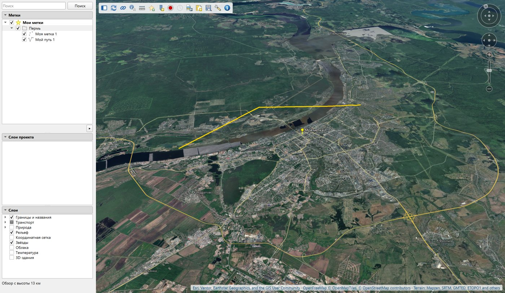
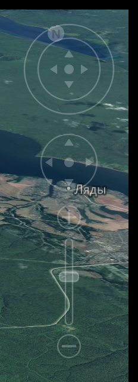
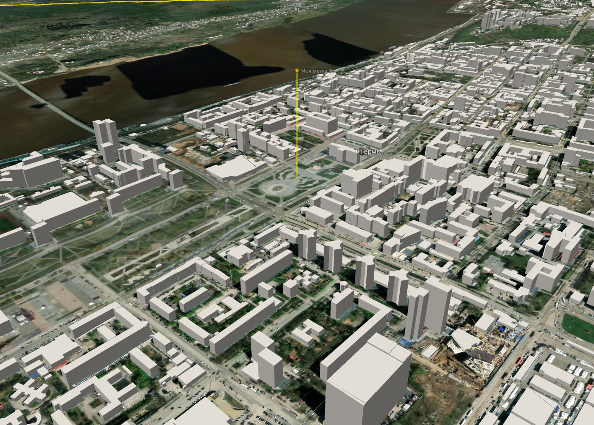
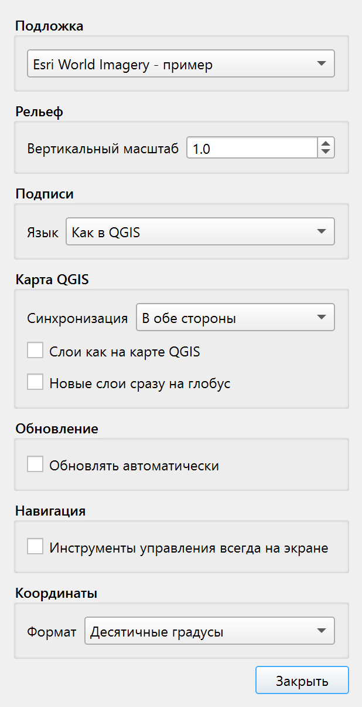
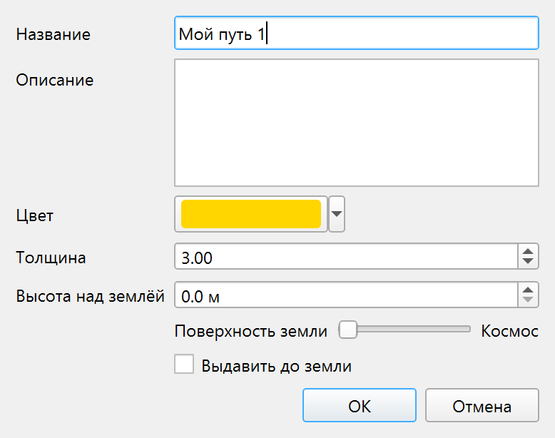
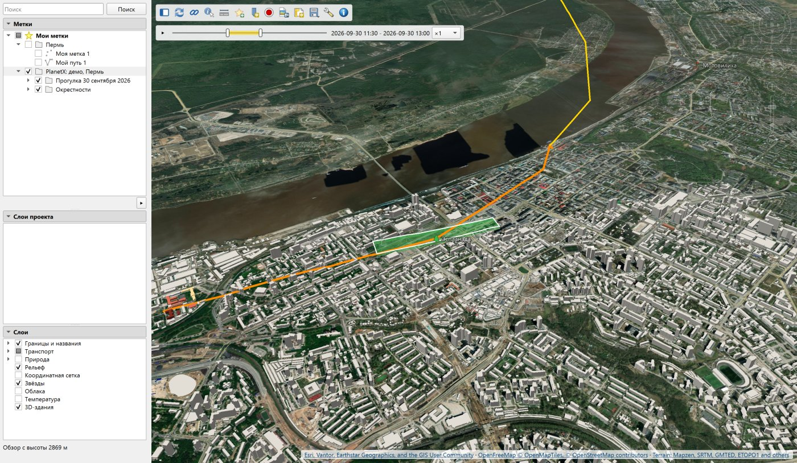
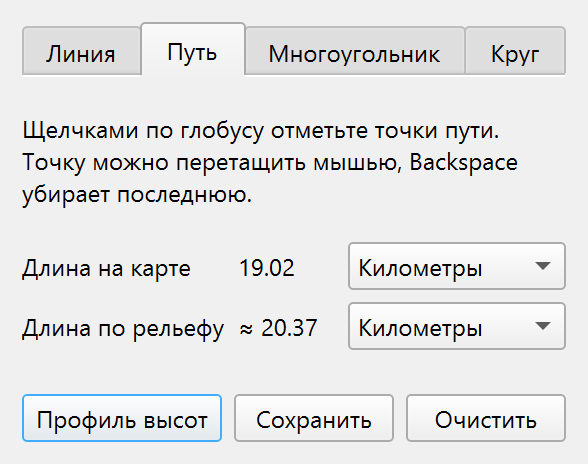
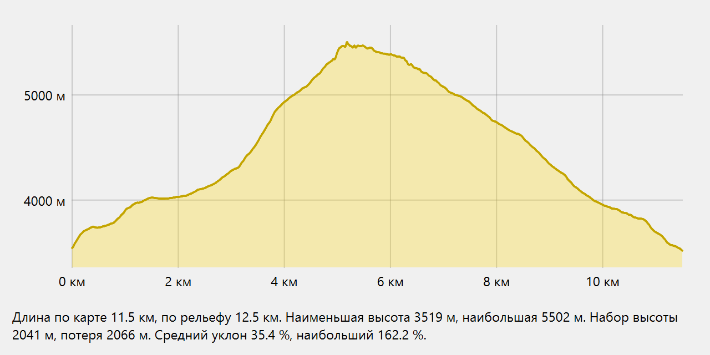

# PlanetX. Руководство

[English version](MANUAL.en.md)

Версия 0.18.0

PlanetX - трёхмерный глобус внутри QGIS. Глобус
открывается в отдельном окне и показывает всю Землю с рельефом
и атмосферой, от вида из космоса до отдельных улиц. На глобус ложатся
слои текущего проекта, свои метки, пути и многоугольники. Туры облетают
метки, запись тура даёт кадры для видео.

Страница модуля - [www.informpp.ru](https://www.informpp.ru/главная-страница/qgis-planetx).

---

## Установка

Модуль работает в QGIS 3.36 и новее, в том числе в QGIS 4. Проверен
на QGIS 3.36 с Qt 5 и на QGIS 4.0 с Qt 6. Нужны видеокарта с OpenGL 3.3
и модуль Python PyOpenGL. В сборках QGIS для Windows PyOpenGL есть.

Меню **Модули → Управление модулями**, поиск по слову PlanetX, кнопка
установки. Перезапуск QGIS не нужен.

Глобус открывается значком на панели инструментов PlanetX или из меню
**Интернет → PlanetX**. Там же стоит пункт «О модуле PlanetX». Если
в сборке QGIS нет PyOpenGL, модуль сообщает об этом и окно не открывает.

## Язык интерфейса

Язык берётся из настроек QGIS, а не системы. При русском языке QGIS
интерфейс модуля русский, при любом другом - английский. Язык подписей
на глобусе задаётся отдельно, в свойствах вида.

---

## Окно глобуса

Слева лежит панель, справа - вид глобуса. В левом верхнем углу вида
стоит панель значков, в правом нижнем - подпись источников данных.
Граница между панелью и видом перетаскивается мышью.



### Панель значков

| Значок | Что делает |
|---|---|
| Боковая панель | Скрывает и показывает левую панель, вид занимает её место |
| Обновить | Показывает новые настройки и слои. Когда есть что показать, значок оранжевый |
| Синхронизация | Связывает глобус с окном карты QGIS |
| Определить объекты | Включает опрос щелчком по глобусу |
| Линейка | Открывает окно «Линейка» |
| Новая метка | Открывает окно «Новая метка» |
| Сохранить вид | Ставит метку в точке взгляда с высотой, азимутом и наклоном |
| Записать тур | Записывает движение камеры туром в «Мои метки» |
| Шкала времени | Открывает и закрывает шкалу времени меток. Доступна, когда у видимых меток есть время |
| Снимок вида | Сохраняет вид в файл PNG или JPEG |
| Вид в макет | Кладёт вид картинкой в макет QGIS |
| Сцена | Меню «Сохранить сцену…» и «Открыть сцену…» |
| Демо | Готовые сцены по телам, см. [Демо](#демо) |
| Тело | Меню планет, спутников, астероидов и «Небо», см. [Другие тела](#другие-тела) и [Звёздное небо](#звёздное-небо) |
| Свойства вида | Подложка, рельеф, подписи, связь с картой, обновление, формат координат |
| О модуле | Управление, источники данных, ссылки |

### Строка состояния

Под левой панелью стоит строка состояния. Обычно в ней высота камеры,
например «Обзор с высоты 2 000 км». Вторая строка показывает координаты
и высоту точки под курсором. Формат координат выбирается в свойствах
вида.

Строка сообщает и о загрузке:

- «загрузка 12» - столько тайлов, картинок слоёв и надписей ещё ждёт
  загрузки.
- «загрузка стоит 7 с» - данные ждут, а ничего не приходит 5 секунд
  и дольше.
- «метки тяжёлые, 250 тыс. вершин» - свои объекты превысили 200 тысяч
  вершин, поворот может стать медленным.
- «Подложка не загрузилась» и «Векторная основа не загрузилась» -
  источник ответил ошибкой.

Пока идёт загрузка, справа от панели значков крутится синий значок.
Короткая подгрузка его не зажигает, он появляется через полсекунды.
Когда загрузка встаёт, значок становится оранжевым. Подсказка значка
говорит, сколько ещё ждёт.

Сообщения поиска, сцен, туров и записи держатся 5 секунд.

---

## Навигация

Навигация идёт мышью, клавишами и инструментами управления.

### Мышь

| Действие | Что происходит |
|---|---|
| Левая кнопка с перетаскиванием | Земля поворачивается вслед за курсором. После отпускания она вращается по инерции |
| Колесо | Приближает и отдаляет. Точка под курсором остаётся на месте |
| Двойной щелчок левой кнопкой | Перелёт к точке под курсором с приближением в 2.5 раза |
| Двойной щелчок правой кнопкой | Отдаление в 2.5 раза |
| Правая кнопка с перетаскиванием | Вверх - ближе, вниз - дальше, к точке нажатия |
| Средняя кнопка или левая с Shift | Поворот и наклон вокруг точки взгляда |
| Левая кнопка с Ctrl | Взгляд по сторонам, глаз стоит на месте |

Камера не опускается ниже 50 м над рельефом. Наклон ограничен 85°.
Когда включена линейка, рисование или опрос, двойной щелчок остаётся
двумя обычными щелчками и ставит точки.

### Клавиши

Клавиши работают, когда вид глобуса в фокусе. Для этого достаточно
щёлкнуть по глобусу.

| Клавиша | Что происходит |
|---|---|
| Стрелки | Сдвиг вида на двадцатую долю ширины окна |
| Shift и стрелки | Поворот и наклон на 3° |
| Ctrl и стрелки | Взгляд по сторонам на 3° |
| PageUp, плюс | Приближение на шаг колеса |
| PageDown, минус | Отдаление на шаг колеса |
| N | Север вверху |
| U | Взгляд отвесно |
| R | Север вверху и взгляд отвесно |
| Пробел | Остановка инерции и перелёта |

### Инструменты управления на экране

В правом верхнем углу вида стоят инструменты управления.



| Инструмент | Что делает |
|---|---|
| Кольцо компаса | Перетаскивание поворачивает вид. Буква N показывает север |
| Буква N | Щелчок ставит север вверху |
| Джойстик в кольце | Пока кнопка нажата, взгляд поворачивается в сторону нажатия |
| Нижний джойстик | Пока кнопка нажата, вид едет в сторону нажатия |
| Плюс и минус | Пока кнопка нажата, камера плавно приближается или отдаляется |
| Ползунок | Бегунок стоит по высоте камеры, перетаскивание задаёт новую |

Скорость джойстиков растёт с отклонением от середины. Инструменты
видны всегда. Пока курсор далеко, они стоят слабым контуром
и не заслоняют вид. Когда курсор подходит к углу вида, они
рисуются целиком.

### Поиск места

В поле «Поиск» вверху панели вводится название места, например
`Пермь`, или координаты. Enter или кнопка «Поиск» запускают поиск.

| Формат | Пример |
|---|---|
| Десятичные градусы | `58.0105, 56.2294` |
| Градусы, минуты, секунды | `58°00′37.8″ с. ш., 56°13′45.8″ в. д.` или `58 00 37.8 N 56 13 45.8 E` |
| UTM | `40V 454464 6430139` |
| MGRS | `40V DK 54464 30138` |

Поиск понимает и строку координат из строки состояния глобуса
вместе с высотой.

- Координаты сразу дают перелёт. Камера садится не выше 2 км
  от точки.
- Название уходит в службу Nominatim на языке подписей. Камера
  перелетает к первому найденному месту и охватывает его целиком.
- Если найдено несколько мест, они показываются списком под полем.
  Щелчок по строке даёт перелёт.
- Найденное место отмечено красной меткой. Очистка поля снимает
  метку и закрывает список.

На дальнее расстояние камера поднимается и плавно садится. Мышь прерывает перелёт.

---

## Левая панель

Панель делится на три раздела - «Метки», «Слои проекта» и «Слои».
Щелчок по заголовку сворачивает раздел, его место занимают открытые.
Какие разделы свёрнуты, глобус запоминает.

### Раздел «Слои»

Флажки в нём срабатывают
сразу, без кнопки «Обновить».

| Группа | Строки |
|---|---|
| Подложка | Источники снимков и карт, отмечен один, последняя строка «Добавить источник тайлов…» |
| Границы и названия | Границы, Населённые пункты, Названия водоёмов |
| Транспорт | Дороги, Номера дорог, Железные дороги, Аэропорты |
| Природа | Реки, Водоёмы, Вершины, Заповедники и нацпарки |
| Рельеф | Высоты Mapzen Terrain Tiles и отмывка склонов |
| Координатная сетка | Параллели и меридианы с подписями, жёлтые экватор, тропики и полярные круги |
| Звёзды | Звёзды ярче 6-й величины и Млечный путь на своих местах неба |
| Облака | Облака по снимкам VIIRS из NASA GIBS за последние полные сутки |
| Температура | Температура поверхности суши днём за 8 дней (MODIS) и моря за сутки (GHRSST MUR) со шкалой в градусах |
| 3D-здания | Объёмные здания OpenStreetMap из тайлов OpenFreeMap, по умолчанию выключены |
| Солнце | Свет рельефа, зданий и воздуха по положению солнца, ночная сторона Земли тёмная, по умолчанию выключено |
| Уклон | Уклон поверхности по высотам классами от ровного до круче 35°, по умолчанию выключен |
| Экспозиция | Сторона, куда обращён склон, цветами сторон света, включается вместо уклона |

Векторная основа берётся из тайлов OpenFreeMap. При первом открытии
включены границы, населённые пункты, рельеф и звёзды. Подсказка
каждой строки говорит, как объект нарисован и с какой высоты он виден.

Шаг сетки меняется с высотой камеры, от 30° из космоса до секунд
у земли. Звёзды стоят так, как они стоят над Землёй в эту минуту, и
гаснут, когда камера опускается ниже 150 км. Картинка Млечного пути,
около 10 МБ, скачивается при первом показе звёзд и дальше берётся
из кэша QGIS. Облака лежат пеленой
поверх снимка. Снег и лёд в облака тоже попадают, они того же цвета.

Температура раскрашивает сушу и море своими шкалами, шкалы в градусах
Цельсия стоят в левом нижнем углу вида. Суша - температура самой
поверхности днём, а не воздуха, сводка за 8 дней. Под облаками на суше
бывают пропуски. Море - температура воды у поверхности за сутки.

Строка «Солнце» освещает рельеф и здания со стороны солнца.
Ночная сторона Земли тёмная, воздух над ней не светится. Время
солнца - конец промежутка открытой шкалы времени, так видно
освещение в час метки. Без шкалы солнце идёт по часам компьютера.
Без строки «Солнце» свет падает с северо-запада под 45°, как на
карте рельефа. Положение солнца считается с точностью около
0.01°, теней нет.

Надписи остаются ровными при любом повороте и наклоне и не налезают
друг на друга. Пункт за горой или за горизонтом не подписан.

Строки «Уклон» и «Экспозиция» раскрашивают поверхность по высотам
рельефа. Уклон - угол склона к горизонту, классы 0-2°, 2-5°, 5-10°,
10-15°, 15-25°, 25-35° и круче 35°, от зелёного к лиловому.
Экспозиция - сторона света, куда склон обращён вниз, у каждой из
восьми сторон свой цвет, место ровнее 0.5° серое. Шкала стоит
в левом нижнем углу вида. Уклон считается по настоящим высотам, без
вертикального масштаба вида. Слой есть у Земли, Марса и Луны,
у других тел высот нет. Точность ограничена пикселем высот. На
Земле он около 5 м у экватора на самом подробном уровне, на Марсе
2.6 км, на Луне 1.3 км.

### Подложка и свой источник тайлов

Группа «Подложка» перечисляет Esri World Imagery, OpenStreetMap
и подключения XYZ Tiles из обозревателя QGIS. Отметка строки сразу
меняет подложку на глобусе. На других телах в группе стоят снимки тела,
выбор недоступен.

Строка «Добавить источник тайлов…» открывает окно нового источника.
В поле «Адрес» вставляется адрес в любом из видов:

- шаблон с `{z}`, `{x}`, `{y}`, например
  `https://{s}.tile.opentopomap.org/{z}/{x}/{y}.png`
- адрес одного тайла, скопированный из браузера, например
  `https://server.arcgisonline.com/ArcGIS/rest/services/World_Topo_Map/MapServer/tile/5/10/17`
- адрес с уровнем, столбцом и рядом в параметрах запроса

Окно приводит адрес к шаблону и предлагает название по имени сервера.
Ниже оно собирает мозаику всего мира из четырёх тайлов уровня 1. Если
север в мозаике внизу, ряды сервера идут снизу вверх, это исправляет
флажок «Ряды снизу вверх (TMS)». Самый подробный уровень окно находит
само, опросом тайлов в точке взгляда глобуса. Заглушки «нет данных»
в счёт не идут. Подпись источника стоит в углу вида и на снимках, для
известных серверов она подставляется сама.

Источник сохраняется подключением XYZ Tiles QGIS и сразу становится
подложкой. Он виден и в обозревателе QGIS, там же его можно изменить
или удалить. Условия использования тайлов задаёт их владелец.

### 3D-здания

Строка «3D-здания» раздела «Слои» ставит на глобус объёмные здания
OpenStreetMap. Контуры и высоты берутся из тех же векторных тайлов
OpenFreeMap, что и векторная основа. По умолчанию строка выключена.



Здания видны, когда камера ближе 6 км к земле. Глобус держит до 32
тайлов зданий вокруг камеры, ближние первыми. Тайлы за спиной камеры
не загружаются.

Высота здания - высота из OpenStreetMap, иначе количество этажей,
умноженное на 3.66 м. Здание без этих сведений получает высоту 5 м.
В центре Перми своя высота есть у двух третей зданий, в центре Москвы
почти у всех. На окраинах многие дома одной высоты. Цвет здания
берётся из OpenStreetMap, иначе здание светло-серое. Крыши плоские.

Низ здания стоит на самой низкой точке рельефа под его контуром.
Снимок вида ждёт, пока загрузятся все здания кадра. Сцена помнит,
включены ли здания.

### Свойства вида

Значок «Свойства вида» на панели значков открывает одноимённое окно.



Окно не мешает работать с глобусом.

| Группа | Поле | Что задаёт |
|---|---|---|
| Подложка | Список | Источник снимков или карты |
| Рельеф | Вертикальный масштаб | Множитель высот от 0.5 до 10 |
| Подписи | Язык | Язык надписей и поиска |
| Карта QGIS | Синхронизация | Направление связи с картой |
| Карта QGIS | Слои как на карте QGIS | Глобус показывает слои, включённые в легенде QGIS |
| Карта QGIS | Новые слои сразу на глобус | Новый слой проекта сразу отмечен на глобусе |
| Обновление | Обновлять автоматически | Глобус обновляется после каждой правки без кнопки «Обновить» |
| Координаты | Формат | Десятичные градусы, градусы-минуты-секунды, UTM или MGRS в строке состояния и окне «Объекты». Выше 84° северной и ниже 80° южной широты UTM и MGRS заменяются десятичными градусами |

Подложка по умолчанию - Esri World Imagery, в списке она названа
«Esri World Imagery - пример». Условия её использования задаёт Esri.
Следом идёт OpenStreetMap, потом подключения XYZ Tiles из обозревателя
QGIS. Подключения рельефа в список не попадают. Новое подключение
появляется в списке при следующем открытии окна.

Язык подписей выбирается из списка. «Как в QGIS» берёт язык интерфейса
QGIS, «Местные названия» оставляет названия на языке страны. Дальше
идут пятнадцать языков. Если названия на выбранном языке нет, для
языков на латинице ставится латинское название, для остальных -
местное.

Смена подложки, масштаба рельефа и слоёв проекта видна после кнопки
«Обновить» на панели значков. Строка состояния напоминает об этом.
Язык подписей меняется сразу.

### Раздел «Слои проекта»

В разделе стоят слои текущего проекта в порядке карты QGIS, у каждого
его тип - растр, точки, линии, полигоны или таблица. Флажок слоя
показывает его на глобусе и не меняет видимость на карте. В новом
проекте флажки сняты. Отметки хранятся в проекте.

Слои ложатся на глобус картинкой, которую рисует QGIS, со стилями
карты. Картинка лежит на рельефе, поднять или выдавить её нельзя.

Подписи векторных слоёв идут отдельно, как названия городов. Они
стоят ровно при любом повороте и наклоне, не налезают друг на друга
и прячутся за горами и горизонтом. Текст, цвет и кегль берутся из
подписей слоя в QGIS, подписи по правилам тоже. Подпись точки стоит
справа от неё, линии - на середине, многоугольника - внутри него.
Подписываются объекты вокруг точки взгляда, не больше 500 на слой.
Масштаб видимости подписей QGIS на глобусе не учитывается.

Двойной щелчок по слою даёт перелёт к его охвату, взгляд отвесный.
Меню по правой кнопке:

- «Подлететь» - перелёт к охвату слоя.
- ползунок «Прозрачность» - прозрачность самого слоя QGIS, она
  меняется и на карте.
- «Трек…» - для точечных слоёв, см. [Треки](#треки).
- «Свойства слоя…» - штатное окно свойств слоя QGIS.

### Раздел «Метки»

Раздел держит папку «Мои метки», её описывает глава
[Мои метки](#мои-метки).

---

## Связь с картой QGIS

### Синхронизация

Значок синхронизации на панели значков связывает глобус с окном карты
QGIS. Направление выбирается в свойствах вида:

- «В обе стороны» - по умолчанию.
- «Карта ведёт глобус» - глобус переходит к охвату карты, наклон
  и азимут глобуса сохраняются.
- «Глобус ведёт карту» - карта встаёт центром в точку взгляда
  глобуса, когда глобус остановится.

Система координат карты любая. Ширина карты на местности равна ширине
вида глобуса.

### Выделение

Объекты, выделенные на карте QGIS, подсвечены на глобусе.

### Определение объектов

Значок «Определить объекты» включает опрос, курсор становится
перекрестием. Щелчок по глобусу ставит метку с координатами и открывает
окно «Объекты».

- В заголовке окна - координаты и высота точки.
- Ниже - слои проекта, отмеченные на глобусе, их объекты под точкой
  и поля объектов. У растра показываются значения в точке.
- Кнопка «Выделить на карте» выделяет найденные объекты в слоях QGIS.
  Выделение видно на карте, в таблице атрибутов и на глобусе.

---

## Мои метки

«Мои метки» - папка вверху раздела «Метки», она отмечена звездой.
В ней лежат метки, пути, многоугольники, сохранённые виды и измерения.
Метки хранятся в одном файле `PlanetX/myplaces.gpkg` в папке профиля
QGIS и видны в любом проекте.

### Строки списка

Значок строки показывает вид объекта - метка, путь, многоугольник,
сохранённый вид или папка. Флажок показывает и скрывает объект на
глобусе, флажок папки - всё её содержимое. Двойной щелчок по метке
даёт перелёт к ней.

Метки и папки переставляются перетаскиванием, в том числе из папки
в папку. По порядку списка идёт тур.

Несколько строк выделяются с Ctrl и Shift. Выделенное перетаскивается
вместе, клавиша Del удаляет его после вопроса.

### Меню

| Где | Пункты |
|---|---|
| «Мои метки» | Добавить, Запустить тур, Сортировать от А до Я, Открыть KML или KMZ…, Сохранить как KML…, Копировать, Вставить, Добавить слои меток в проект |
| Папка | Подлететь, Добавить, Вырезать, Копировать, Вставить, Удалить, Переименовать…, Открыть KML или KMZ…, Сохранить как KML…, Снимок вида папки, Сортировать от А до Я, Запустить тур, Свойства… |
| Метка | Подлететь, Тур по пути, Снимок вида метки, Свойства…, Новая папка, Вырезать, Копировать, Вставить, Переименовать…, Удалить |
| Несколько строк | Копировать, Показать выбранное, Скрыть выбранное, Удалить выбранное |
| Пустое место | Новая папка, Открыть KML или KMZ…, Вставить |

Пункт «Тур по пути» есть только у путей. Подменю «Добавить» создаёт
в папке папку, метку, путь, многоугольник или записанный тур. Метка,
путь и многоугольник рисуются в окне «Новая метка», тур записывается
кнопкой записи. «Вырезать» копирует строку в буфер обмена и убирает
её из списка, «Вставить» кладёт её на новое место. «Сортировать от А
до Я» ставит метки и папки по названию.

### Свойства папки

Окно «Свойства папки» открывается из меню папки:

| Поле | Что задаёт |
|---|---|
| Название | Название папки в списке |
| Разрешить раскрывать папку | Без флажка папка в списке не раскрывается, флажок папки показывает и скрывает всё её содержимое |
| Показать содержание как группу переключателей | На глобусе видна одна строка папки, флажок одной снимает флажки остальных |
| Описание | Текст о папке, подсказка строки в списке |
| Вид | Точка взгляда, расстояние, азимут и наклон, кнопки «Снимок текущего вида» и «Сброс» |

Двойной щелчок по папке и пункт «Подлететь» её меню дают перелёт
к виду папки. Без своего вида перелёт берёт в кадр все метки папки.
Вид задаётся вручную числами на вкладке «Вид» или снимком. Пункт
«Снимок вида папки» ставит виду папки вид глобуса. Описание, вид
и способ показа содержимого переходят в KML и обратно.

Новая папка появляется сразу с названием «Новая папка» и
переименовывается потом. На папке она создаётся внутри, на метке -
сразу под ней. Папка удаляется вместе с содержимым после вопроса.

Пункт «Добавить слои меток в проект» добавляет в проект три слоя
файла меток - точки, линии и многоугольники. Атрибуты и отмена у них
штатные.

### Новая метка

Значок «Новая метка» открывает окно с вкладками «Метка», «Путь»
и «Многоугольник».

- Метка ставится щелчком по глобусу, новый щелчок переносит её.
- Точки пути и вершины многоугольника ставятся щелчками по глобусу.
- Поле «Название» сразу заполнено названием с номером - «Моя метка 1»,
  «Мой путь 1», «Мой многоугольник 1». У каждого вида свой счёт.
  Название можно сменить в том же поле.
- «Цвет» задаёт цвет линии и контура, заливка многоугольника того же
  цвета, полупрозрачная. «Толщина» задаётся в пикселях экрана.

Кнопка «Сохранить» записывает объект в выбранную папку «Моих меток».
Окно остаётся открытым для следующего объекта. Кнопка «Очистить»
убирает поставленные точки.

### Сохранённый вид

Значок «Сохранить вид» ставит метку в точке взгляда. Название
предлагается с номером - «Вид 1», «Вид 2». В метке хранятся расстояние,
азимут и наклон камеры. Перелёт к такой метке возвращает вид целиком.

### Свойства метки



Пункт «Свойства…» открывает окно свойств. Окно не мешает работать
с глобусом, вид можно поворачивать и приближать. Каждая правка сразу
видна на глобусе. «OK» записывает правки в метку, «Отмена» возвращает
прежний вид.

| Поле | Что задаёт |
|---|---|
| Название | Название в списке и подпись на глобусе |
| Описание | Текст метки, он уходит и в KML |
| Значок | Значок точки из набора QGIS, в KML - стандартный значок той же темы |
| Цвет, Толщина | Цвет значка точки, цвет и толщина линии и контура |
| Заливка | Цвет заливки многоугольника и стены |
| Высота над землёй | Подъём объекта над рельефом в метрах. Ползунок «Поверхность земли - Космос» под полем задаёт её от земли до 100 км |
| Выдавить до земли | Стена от объекта до земли, у метки - столбик |
| Время | Момент или промежуток метки для шкалы времени |
| Вид метки | Точка взгляда, расстояние, азимут, наклон камеры у метки и дата вида |

Выдавливание работает при высоте больше нуля. Путь становится стеной,
многоугольник - объёмом.

### Вид метки

У любой метки может быть свой вид.
Вид - это точка, на которую смотрит камера, расстояние до неё, азимут
и наклон. Точка взгляда может не совпадать с меткой. По виду идут
«Подлететь», двойной щелчок по метке и остановка тура.

«Снимок вида метки» в меню метки делает текущий вид глобуса видом
метки. В окне свойств те же величины стоят в разделе «Вид метки».
Кнопка «Снимок текущего вида» берёт вид глобуса, «Сброс» возвращает
вид, который был при открытии окна. Снятый флажок раздела убирает
вид, тогда камера берёт метку в кадр целиком. Вид уходит в KML
элементом LookAt и читается из него.

### Копировать и вставить

«Копировать» или Ctrl+C кладёт выделенные метки и папки в буфер
обмена текстом KML. Текст вставляется в блокнот,
правится и копируется обратно. «Вставить» или Ctrl+V кладёт метки
из буфера в папку. На метке это её папка, на пустом месте - корень
«Мои метки». Папки из буфера вставляются папками. KML, скопированный
в Google Earth, вставляется так же.

### Время меток и шкала времени

У метки может быть своё время. Это момент или
промежуток, поле «Время» в свойствах метки. В KML время пишется как
TimeStamp и TimeSpan. У вида метки время своё, поле «Дата/время»
в разделе «Вид метки».



Шкала времени открывается кнопкой «Шкала времени» на панели значков.
Кнопка доступна, когда у видимых меток есть время. Шкала охватывает
время меток от самого раннего до самого позднего. Закрытая шкала
метки не скрывает, видны все.

| Часть шкалы | Что делает |
|---|---|
| Бегунки | Задают промежуток. Метки вне промежутка скрыты, метки без времени видны всегда |
| Полоса между бегунками | Перетаскивание сдвигает промежуток целиком, щелчок по полосе ставит его серединой в точку щелчка |
| ⏮, ⏭ | Промежуток той же ширины встаёт в начало или конец шкалы |
| ▶, ⏸ | Проигрывание и пауза: промежуток идёт вдоль шкалы |
| 🔁 | Проигрывание по кругу, после конца шкалы промежуток идёт с начала |
| ×1 | Скорость проигрывания, при ×1 шкала проходится за 20 секунд |
| ⏹ | Закрывает шкалу |

Перелёт к метке и тур ставят шкалу на время вида метки, а без него - на
время самой метки. Закрытая шкала при этом открывается. Шкала своя и не зависит от «Временного контроллера»
QGIS, по которому идут треки.

### KML и KMZ

«Открыть KML или KMZ…» кладёт файл KML или KMZ, в том числе
из Google Earth, в «Мои метки» новой папкой с именем файла. Папки,
стили, значки, время и виды меток сохраняются, `gx:Tour` становится записанным туром. Камера
перелетает к содержимому файла.

«Сохранить как KML…» сохраняет папку или все «Мои метки» в KMZ или KML.
Формат выбирается расширением файла.

---

## Линейка

Значок «Линейка» открывает окно с вкладками «Линия», «Путь»,
«Многоугольник», «Круг», «3D-путь» и «3D-многоугольник». Точки ставятся щелчками по глобусу,
за курсором тянется резинка.



| Вкладка | Величины |
|---|---|
| Линия | Длина на карте, длина по рельефу, курс. Третий щелчок начинает новую линию |
| Путь | Длина на карте, длина по рельефу |
| Многоугольник | Периметр, площадь |
| Круг | Радиус, периметр, площадь. Первый щелчок - центр, второй - радиус |
| 3D-путь | Длина прямыми отрезками в пространстве |
| 3D-многоугольник | Периметр, площадь в плоскости многоугольника, наклон плоскости |

Длина на карте, периметр и площадь считаются на эллипсоиде WGS84. Длина
по рельефу идёт вдоль поверхности с подъёмами и спусками. Курс - азимут
начала линии от севера по часовой стрелке. Единицы выбираются у каждой
величины - метры, километры, мили, морские мили, для площади
квадратные метры, гектары, квадратные километры, квадратные мили.

Высоты для длины по рельефу берутся из Mapzen Terrain Tiles. Недостающие
тайлы высот вдоль линии загружаются, даже если рельеф выключен. Пока
они загружаются, перед длиной по рельефу стоит «≈».

Точку линейки можно схватить мышью и перетащить, Backspace убирает
последнюю точку. У каждого отрезка на глобусе подписана его длина.

Кнопка «Сохранить» кладёт фигуру в «Мои метки» вместе с измерением.
Название предлагается с номером, например «Линия 1». Измерение видно
в подсказке строки.

Вкладки «3D-путь» и «3D-многоугольник» ставят точку на крышу
или стену 3D-здания, если луч из глаза встречает его раньше
рельефа, и запоминают высоту точки. Отрезки между точками прямые
и на рельеф не садятся. Площадь 3D-многоугольника
меряется в его плоскости, так у ската крыши или стены она
настоящая. Наклон - угол плоскости к горизонту, 0 - ровная
крыша, 90 - стена. Сохранённый 3D-объект уходит в KML
с altitudeMode absolute.

Окна «Линейка» и «Новая метка» открыты по одному. Открытие одного
закрывает другое.

### Профиль высот

Кнопка «Профиль высот» линейки и пункт «Профиль высот» в меню пути
«Моих меток» открывают график высоты вдоль линии.



Под графиком стоят длина по карте и по рельефу, наименьшая
и наибольшая высота, набор и потеря высоты, средний и наибольший уклон.
Курсор над графиком показывает расстояние, высоту и уклон в этом месте,
на глобусе точка отмечена меткой с высотой. Профиль линейки меняется
вместе с её точками.

Высоты берутся так же, как для длины по рельефу. Уклон меряется
на отрезке не короче трёх пикселей данных высот, так шероховатость
данных не выдаётся за обрыв. На крутых горах наибольший уклон может
превышать 100 %, это 45°.

### Видимость из точки

Пункт «Видимость отсюда…» в меню точечной метки открывает окно
«Видимость из точки». В окне задаются высота наблюдателя над рельефом,
высота цели и радиус круга. Кнопка «Построить» загружает высоты под
кругом и раскрашивает его. Видимые места зелёные, скрытые рельефом -
красные. Кнопка «Убрать» снимает раскраску.

Из точки расходятся лучи с равным шагом по азимуту. Шаг вдоль луча -
пятисотая доля радиуса, при радиусе 10 км это 20 м. Место видно, если
луч из глаза к нему не задевает рельеф по дороге. Учитываются кривизна
тела и у Земли рефракция с коэффициентом 0.13. Здания и лес не
учитываются. Под окном стоит доля видимой площади круга. Если высоты
не загрузились за 30 с, расчёт идёт по менее подробным, окно об этом
пишет. Видимость считается на Земле, Марсе и Луне.

### Инсоляция

Пункт «Инсоляция…» в меню точечной метки открывает окно «Инсоляция».
В окне задаются первые и последние сутки промежутка и радиус круга.
Кнопка «Построить» загружает высоты и раскрашивает круг по среднему
количеству часов прямого солнца в сутки. Синий цвет - мало света,
красный - много. Шкала в левом нижнем углу вида идёт от нуля до
наибольшего значения в круге. Кнопка «Убрать» снимает раскраску.

Положение солнца считается через каждые 10 минут суток UTC. Место
освещено, если солнце выше горизонта гор по своему азимуту и падает
на склон с его лицевой стороны. Горизонт берётся по 32 направлениям
на расстоянии не меньше радиуса и не меньше 5 км. Промежуток длиннее
15 суток считается по 15 суткам, взятым равномерно. Облака, рефракция,
здания и лес не учитываются. Сетка высот - 800 узлов на сторону, при
радиусе 5 км шаг 25 м. Расчёт идёт частями, глобус в это время
отвечает мыши. Строка под полями показывает долю сделанного.
Инсоляция считается только для Земли.

---

## Туры

Тур облетает отмеченные метки папки по порядку списка, включая
вложенные папки.

- Метка со своим видом возвращает его точку взгляда, расстояние,
  азимут и наклон.
- Вдоль пути камера едет по линии.
- Остальные метки берутся в кадр целиком.

Тур запускается пунктом «Запустить тур» в меню «Моих меток» или папки,
пунктом «Тур по пути» в меню пути или кнопкой ▶ под списком меток.
Кнопка ведёт тур по выделенной папке или пути, а при выделенной метке -
по папке, в которой метка лежит. Тур проходит метки тела, которое
сейчас на глобусе. Если отмеченных меток нет, строка состояния об этом
сообщает.

Внизу вида появляется панель тура:

| Кнопка | Что делает |
|---|---|
| Ползунок | Показывает, сколько тура прошло, и перематывает тур. Камера сразу встаёт в выбранную точку, после отпускания тур идёт дальше с неё |
| ⏮, ⏭ | Предыдущая и следующая остановка |
| ⏸, ▶ | Пауза и продолжение |
| Пауза | Сколько секунд камера стоит на остановке |
| 🔁 | Тур по кругу. После последней остановки тур начинается с первой. Состояние кнопки сохраняется между сеансами |
| ⏺ | Запись тура кадрами PNG |
| ⏹ | Конец тура |

Движение мышью ставит тур на паузу.

### Запись тура с экрана

Кнопка записи ⏺ на панели значков записывает движение камеры.
Камеру можно вести мышью, клавишами, перелётами
и инструментами управления. Повторный щелчок заканчивает запись
и спрашивает название. Тур ложится в «Мои метки» со значком фильма,
на глобусе он не рисуется.

Пункт «Запустить тур» в меню такого тура проигрывает запись. Камера
сначала подлетает к началу записи. Ползунок панели тура и запись
кадрами PNG работают так же, как у тура по меткам. В KML записанный
тур сохраняется как `gx:Tour`, Google Earth его проигрывает.

### Запись тура для видео

Кнопка ⏺ спрашивает папку и записывает в неё тур кадрами PNG,
25 кадров в секунду тура. Размер кадра равен размеру окна. Подпись
источников стоит в углу каждого кадра. Файлы называются
`frame_00000.png`, `frame_00001.png` и дальше, кадры с теми же номерами
в папке заменяются.

Каждый кадр ждёт загрузки тайлов, поэтому запись идёт дольше тура,
а на кадрах нет размытых мест. Кадр, который ждёт дольше 20 секунд,
снимается как есть. Запись всегда начинается с первой остановки,
поэтому повтор записи даёт те же кадры.

Рядом с кадрами ложится файл `frames.json` - частота, размер, поза
камеры и время данных каждого кадра, номера недогруженных кадров.

Панель показывает номер кадра. Крестик на панели прерывает запись.

### Как собрать ролик из кадров

PlanetX пишет кадры, а не видеофайл. Ролик из них собирает любая
программа, которая открывает последовательность картинок.

Бесплатная программа ffmpeg (ffmpeg.org) собирает MP4 одной командой
в папке с кадрами:

```
ffmpeg -framerate 25 -i frame_%05d.png -vf "pad=ceil(iw/2)*2:ceil(ih/2)*2" -c:v libx264 -pix_fmt yuv420p -crf 18 tour.mp4
```

Частота 25 совпадает с частотой записи, поэтому ролик идёт в темпе
тура. Фильтр `pad` добавляет по пикселю, если сторона кадра нечётная,
кодек H.264 требует чётных сторон. Меньшее значение `-crf` даёт
лучшее качество и больший файл.

Видеоредакторы Shotcut и DaVinci Resolve открывают кадры с номерами
как один клип. Туда же можно добавить музыку, подписи и склейку
нескольких туров.

---

## Треки

Трек показывает путь движущихся объектов по времени. Источник - точечный
слой проекта с полем времени, время задаёт «Временной контроллер»
QGIS.

Пункт «Трек…» в меню точечного слоя открывает окно настроек:

| Поле | Что задаёт |
|---|---|
| Время | Поле с датой и временем, текстом ISO 8601 или секундами с 1970 года |
| Объект | Поле, которое различает объекты. «Один объект» - все точки один путь |
| Цвет | Цвет пройденного пути |
| Камера следом | Камера держит первый объект в середине вида по ходу движения |

У каждого объекта растёт пройденный путь до конца текущего промежутка
контроллера, в текущей точке стоит метка с его названием. Когда
контроллер выключен, треки показываются целиком. Кнопка «Убрать трек»
возвращает слою обычный вид. Настройки треков хранятся в проекте.

Во время записи тура треки растут по ходу тура через весь промежуток
контроллера.

---

## Сцены

Сцена сохраняет вид целиком и передаётся другим людям. Значок «Сцена»
открывает меню «Сохранить сцену…» и «Открыть сцену…». Файл сцены имеет
расширение `.planetx`.

В сцене хранятся:

- поза камеры.
- время «Временного контроллера».
- слои проекта, отмеченные на глобусе, ссылкой на источник.
- подложка, рельеф, масштаб рельефа, группы раздела «Слои», язык
  подписей.
- строки раздела «Слои» - сетка, звёзды, облака, температура
  и 3D-здания.
- выбранная папка «Моих меток» с её туром.

Пароль базы данных в файл не попадает, ссылка на настройку подключения
QGIS остаётся. Если выбрана папка «Мои метки» целиком или не выбрано
ничего, метки в сцену не попадают.

При открытии сцены слой ищется в проекте по источнику, если его нет -
добавляется. Остальные слои проекта на глобусе снимаются. Метки сцены
ложатся новой папкой, камера перелетает в позу сцены. Слои, которые
не нашлись и не открылись, перечисляет строка состояния.


### Демо

Значок «Демо» с академической шапочкой на панели значков открывает
подготовленные сцены. Каждая сцена помещает метки новой папкой в «Мои
метки», кнопка ▶ под списком проводит по ним тур. Папку можно удалить.

| Раздел | Сцена | Что в ней |
|---|---|---|
| Земля | Пермь | Метки со значками и моментами времени прогулки, виды меток с датой, маршрут, выдавленный многоугольник, путь вдоль Камы, записанный облёт центра, 3D-здания |
| Земля | Бока-Чика, Starbase | Стартовая площадка и завод Starbase, пляж, соседние города, шоссе из Браунсвилла, записанный облёт площадки |
| Марс | Места посадок марсоходов | Гора Олимп, долины Маринер, места посадок «Кьюриосити», «Персеверанс», «Чжужуна», «Спирита» и «Оппортьюнити» |
| Луна | «Аполлоны» и «Луноходы» | Места посадок шести «Аполлонов», «Лунохода-1» и «Лунохода-2» |
| Небо | Созвездия и яркие объекты неба | Орион, Плеяды, галактика Андромеды (M31), Кассиопея, Большая Медведица, Лира с Вегой, Южный Крест |

Время прогулки в Перми условное. Координаты посадок округлены до сотых
градуса.

---

## Снимок вида и вид в макет

### Снимок вида

Значок «Снимок вида» открывает окно с шириной и высотой снимка
в пикселях. Снимок может быть больше окна, глобус догружает для него
подробные тайлы. Флажок «Пропорции окна» держит высоту по ширине.

Кнопка «Сохранить…» спрашивает файл PNG или JPEG и начинает снимок.
Камера на это время стоит. Кнопка «Снять сейчас» не ждёт остальных
тайлов. Подпись источников стоит в правом нижнем углу снимка.

### Вид в макет

Значок «Вид в макет» кладёт вид неизменной картинкой в макет QGIS,
существующий или новый.

| Поле | Что задаёт |
|---|---|
| Макет | Существующий макет или «Новый макет» |
| Ширина, Высота | Размер картинки на листе в миллиметрах |
| Разрешение | Разрешение вывода макета, от него размер снимка в пикселях |

Картинка хранится внутри проекта. После вставки открывается окно
макета.

---

## Другие тела

Значок «Тело» на панели значков открывает меню тел. Вверху стоит
Земля, под разделителем Луна и Марс, ниже подменю:

| Подменю | Тела |
|---|---|
| Планеты | Меркурий, Венера, Юпитер |
| Спутники Юпитера | Ио, Европа, Ганимед, Каллисто |
| Спутники Сатурна | Мимас, Энцелад, Тефия, Диона, Рея, Титан, Япет |
| Астероиды | Церера, Веста |

В меню только тела, снятые аппаратами целиком. У Плутона, Харона
и Тритона не снято от 24 до 33 % шара, их в меню нет.

Выбранное тело встаёт на место Земли. Меняются размер шара,
снимки и атмосфера, камера перелетает к начальной точке тела. У Марса
это гора Олимп, у Луны - Море Спокойствия, место посадки
«Аполлона-11», у Меркурия - бассейн Калорис, у Венеры - горы
Максвелла. У прочих тел это точка на экваторе и нулевом меридиане.

Снимки тел, кроме Марса и Луны, - глобальные мозаики USGS
Astrogeology и NASA по съёмке аппаратов MESSENGER, Magellan, Galileo,
Voyager, Cassini и Dawn. Пиксель тайлов у экватора -
от 100 м у Энцелада и Весты до 120 км у Юпитера. Часть снимков
не похожа на вид глазом:

- Венера показана радаром Magellan, цвет передаёт высоту
- Юпитер - карта облаков Cassini декабря 2000 года, облака на ней
  неподвижны
- Титан снят в ближнем инфракрасном свете сквозь дымку
- Меркурий, Ио и Ганимед цветные, остальные тела серые

Шар каждого тела - сфера, у Юпитера - сжатый эллипсоид. Веста, Церера
и малые спутники на деле несферичны, на сфере их снимки слегка
искажены.

Снимки Марса - цветная мозаика Viking MDIM2.1, около 650 м
на пиксель. Снимки Луны - карта альбедо LOLA с отмывкой рельефа, около
670 м на пиксель. У Марса разреженная пыльная атмосфера, у Луны
атмосферы нет.

Рельеф Марса построен по высотам MOLA MEGDR, рельеф Луны - по высотам
LOLA GDR. Высоты округлены до 10 м у Марса и до 20 м у Луны. Пиксель
высот у экватора - 2.6 км у Марса и 1.3 км у Луны. Рельеф включается
той же строкой «Рельеф» раздела «Слои», вертикальный масштаб задаётся
в свойствах вида. Высоты Марса отсчитываются от ареоида, высоты Луны -
от сферы радиусом 1737.4 км. Впадины ниже нуля сохраняются, дно
равнины Эллада лежит на 7-8 км ниже нуля.

На других телах работают навигация, сетка, звёзды, линейка,
«Мои метки», туры, снимок вида и сцены, на Марсе и Луне ещё и рельеф.
Выключены функции, данные которых есть только для Земли:

- векторная основа, облака, температура, 3D-здания и солнце
- слои проекта и их подписи, треки
- синхронизация с картой QGIS и определение объектов
- поиск места по названию. Координаты в поле поиска работают

Каждая метка помнит своё тело. В «Моих метках» видны метки всех тел,
на глобусе - только метки текущего. Перелёт к метке другого тела
сначала переключает тело. Тур проходит остановки текущего тела.
Сцена хранит тело и открывается на нём.

## Звёздное небо

Пункт «Небо» меню «Тело» показывает небо из центра небесной сферы.
На нём Млечный путь, 5080 звёзд до 6-й звёздной величины, линии
и названия 88 созвездий, имена ярких звёзд, Солнце, Луна и планеты
от Меркурия до Нептуна. Северный полюс мира вверху, восток слева, как
на звёздной карте.

| Действие | Что делает |
|---|---|
| Перетаскивание левой кнопкой | Небо тянется за курсором |
| Колесо, PageUp, PageDown, плюс, минус | Меняет поле зрения от 2° до 110° |
| Двойной щелчок левой | Точка встаёт в середину, поле зрения вдвое меньше |
| Двойной щелчок правой | Поле зрения вдвое больше |
| Стрелки | Взгляд сдвигается на десятую часть высоты окна |

Строка состояния показывает поле зрения, прямое восхождение
и склонение точки под курсором. Экваториальные координаты отнесены
к эпохе J2000.0. Солнце, Луна и планеты показаны на конец промежутка
открытой шкалы времени, иначе на момент часов компьютера. Положения
планет отличаются от эфемерид JPL Horizons не больше чем на 0.2°
в 1800-2050 годах, положение Луны - не больше чем на 0.3°.

Пункт «Созвездия» того же меню убирает и возвращает линии и названия
созвездий. Звёзды, их имена, Солнце, Луна и планеты остаются.

На небе работают метки и туры. «Сохранить вид» ставит метку
с направлением взгляда и полем зрения. «Новая метка» ставит точку
щелчком по небу. «Записать тур» записывает движение по небу. Метки
неба хранятся в «Моих метках» вместе с прочими, на небе они показаны
жёлтыми кружками с подписью. Тур и кнопка ▶ на небе проходят метки неба,
между далёкими точками поле зрения по пути расширяется. Перелёт
к метке неба из списка включает небо.

Линейка, синхронизация и опрос объектов на небе выключены. Снимок вида
сохраняет небо вместе с подписями. Сцена хранит направление взгляда
и поле зрения. Чтобы вернуться к телу, его выбирают в том же меню.

---

## Ограничения

- Слои проекта лежат на рельефе картинкой, поднять или выдавить слой
  по полю нельзя. Подъём и выдавливание есть у своих меток.
- Картинки слоёв проекта по времени контроллера не фильтруются.
- Выше широты 85° полюса закрыты цветом океана, так кончается сетка
  тайлов Web Mercator.
- Запись тура идёт медленнее самого тура.
- Здания - коробки с плоской крышей, формы крыш и фасады
  не передаются.
- Высоты Марса и Луны грубее земных, пиксель высот у экватора
  2.6 км и 1.3 км. Кратеры меньше 5-10 км по высотам не видны.
- В KML тело метки не пишется, метки из файла KML встают на текущее
  тело.
- Небо показано из центра Земли, без горизонта места наблюдения.
  Координаты не приводятся к дате, к 2026 году прецессия смещает их
  примерно на 0.36°.

## Источники данных

Космоснимки - Esri World Imagery, условия задаёт Esri. Картографические
данные © участники OpenStreetMap. Векторные тайлы и 3D-здания - OpenFreeMap.
Рельеф - Mapzen Terrain Tiles, данные SRTM, GMTED, ETOPO1 и других
источников. Облака - NASA GIBS, снимки VIIRS. Температура - NASA
GIBS, MODIS и GHRSST MUR. Звёзды - каталог ярких
звёзд Йельского университета. Млечный путь - NASA/Goddard Space
Flight Center Scientific Visualization Studio, Gaia DR2: ESA/Gaia/DPAC.
Поиск мест - Nominatim. Марс - NASA, USGS, Viking MDIM2.1, Луна -
USGS, LRO LOLA, тайлы обоих тел - OpenPlanetaryMap. Высоты Марса -
NASA MGS MOLA MEGDR, высоты Луны - NASA LRO LOLA GDR. Снимки прочих
тел - глобальные мозаики USGS Astrogeology и NASA Photojournal
по данным NASA, JPL, DLR и институтов миссий, подпись каждого
тела стоит в углу вида. Линии, названия
созвездий и имена звёзд - d3-celestial, © Olaf Frohn. Положения планет
рассчитаны по элементам орбит JPL, положение Луны - по формулам
Астрономического альманаха.

Условия всех источников разобраны в [SOURCES.md](SOURCES.md).
Тайлы идут через сетевые настройки и кэш QGIS, свой кэш модуль
не заводит.

Разработка при поддержке ООО «Информ++». Лицензия GNU GPL версии 3.
